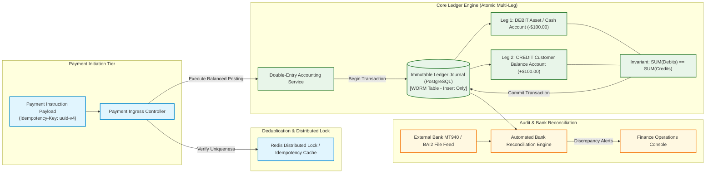

# Financial Data Flow & Double-Entry Ledger Pipeline

Strict financial accounting architecture enforcing double-entry bookkeeping invariants, transactional idempotency, and immutable audit journals.

## Mermaid Architecture Diagram



## PlantUML Specification

```plantuml
@startuml
autonumber
actor Client
participant "Payment Gateway" as gw
database "Idempotency Cache" as redis
participant "Ledger Engine" as ledger
database "Ledger Journal DB" as db
participant "Bank Feeds" as bank
component "Reconciliation" as recon

Client -> gw : POST /transfers (Idempotency-Key)
gw -> redis : Acquire Lock & Check Existing Key
redis -> gw : Lock Granted (New Transaction)
gw -> ledger : Post Double-Entry Transaction
ledger -> db : Insert Debit & Credit Legs (Zero-Sum Invariant)
db -> ledger : Commit Success
ledger -> redis : Cache Completed Result Payload
ledger -> Client : 201 Created (Transfer Confirmed)
recon -> db : Read Cleared Postings
bank -> recon : Ingest Daily Bank Statement
recon -> recon : Reconcile Settlement Accounts
@enduml
```

## Architectural Design Considerations

* **Strict Invariant Enforcement**: Every transaction must record at least two balanced entries; `SUM(Debits) - SUM(Credits) == 0` must be mathematically enforced via database constraints.
* **Append-Only Immutable Ledger**: Never execute `UPDATE` or `DELETE` on financial ledger entries; correct historical errors exclusively through explicit reversal and offsetting journal postings.
* **Idempotency Keys**: Mandate unique `Idempotency-Key` headers for all money movement APIs to guarantee safe retries across network timeouts.

## Related Documentation & Patterns

* [Sequence: Payment Flow](file:///d:/company/products/enterprise-architecture-handbook/17-diagrams/sequence/payment.md)
* [PII Data Flow](file:///d:/company/products/enterprise-architecture-handbook/17-diagrams/data-flow/pii-flow.md)
* [Physical Data Flow](file:///d:/company/products/enterprise-architecture-handbook/17-diagrams/data-flow/physical-data-flow.md)
