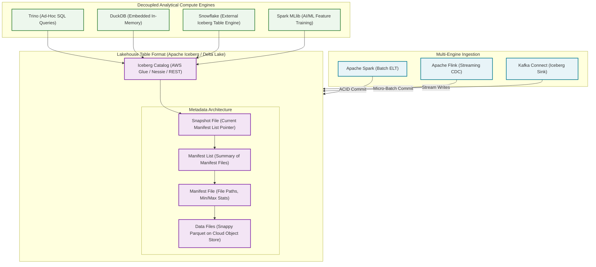
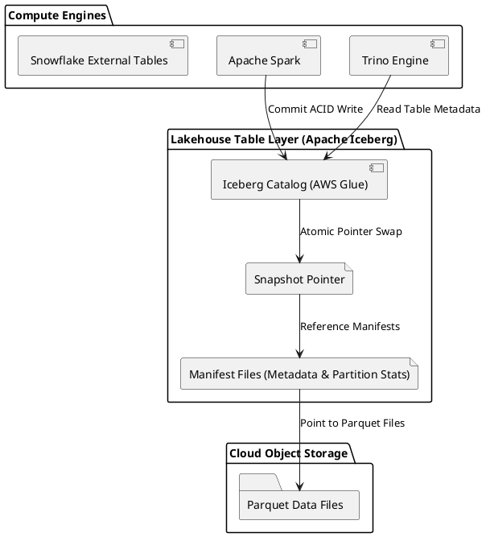

# Modern Open Lakehouse Architecture (Apache Iceberg & Delta Lake)

Converged storage architecture bringing ACID transactions, schema enforcement, time-travel queries, and zero-copy cloning to open cloud object storage.

## Mermaid Architecture Diagram

## PlantUML Specification

## Architectural Design Considerations

* **Open Table Formats**: Apache Iceberg and Delta Lake eliminate vendor lock-in by allowing multiple disparate compute engines (Trino, Spark, Snowflake) to read the same storage.
* **Metadata Pruning**: Iceberg manifest files store column min/max statistics, allowing engines to skip entire Parquet files without reading them from object storage.
* **Time Travel and Rollback**: Every mutation generates an immutable snapshot, enabling exact historical query reproduction and zero-downtime rollback.

## Related Documentation & Patterns

* [Data Lake](file:///d:/company/products/enterprise-architecture-handbook/17-diagrams/data-flow/data-lake.md)
* [Data Warehouse](file:///d:/company/products/enterprise-architecture-handbook/17-diagrams/data-flow/data-warehouse.md)
* [Modern ELT](file:///d:/company/products/enterprise-architecture-handbook/17-diagrams/data-flow/elt.md)
