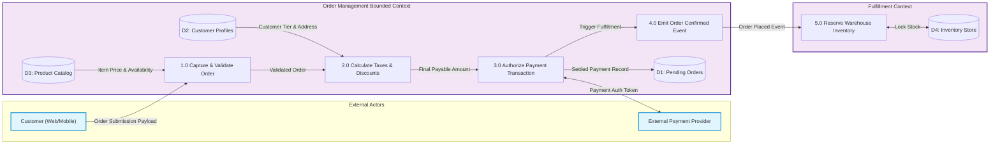
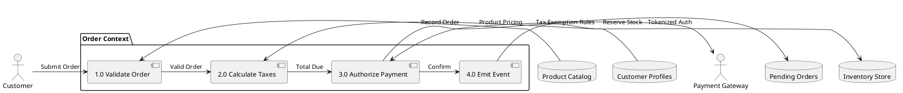

# Logical Data Flow Diagram (DFD Level 1)

Domain-level logical flow representing business data transformation, validation gates, and domain boundaries without coupling to specific hardware or infrastructure vendors.

## Mermaid Architecture Diagram

## PlantUML Specification

## Architectural Design Considerations

* **Technology Agnosticism**: Logical DFDs depict *what* data transformations take place rather than *how* or *where* (e.g., whether a datastore is Postgres or Cassandra).
* **Data Store Boundaries**: Data stores must be scoped to bounded contexts; no direct cross-context database queries without explicit API or event interfaces.
* **Idempotency Guarantees**: Define logical idempotency keys at entry process nodes to reject duplicate business submissions.

## Related Documentation & Patterns

* [Physical Data Flow](file:///d:/company/products/enterprise-architecture-handbook/17-diagrams/data-flow/physical-data-flow.md)
* [Event-Driven Data Flow](file:///d:/company/products/enterprise-architecture-handbook/17-diagrams/data-flow/event-driven.md)
* [Sequence: Order Processing](file:///d:/company/products/enterprise-architecture-handbook/17-diagrams/sequence/order-processing.md)
