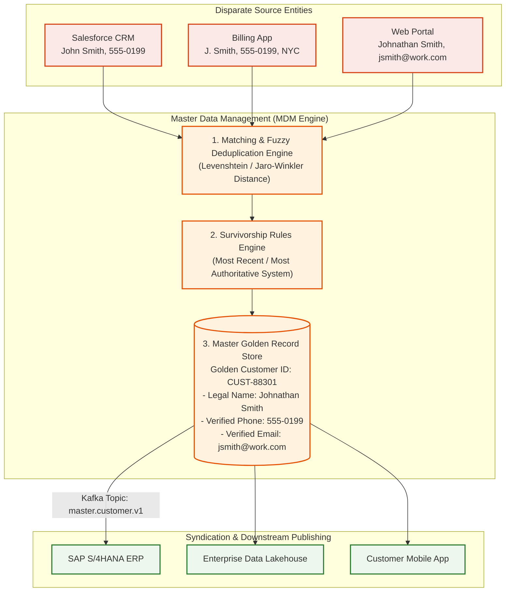
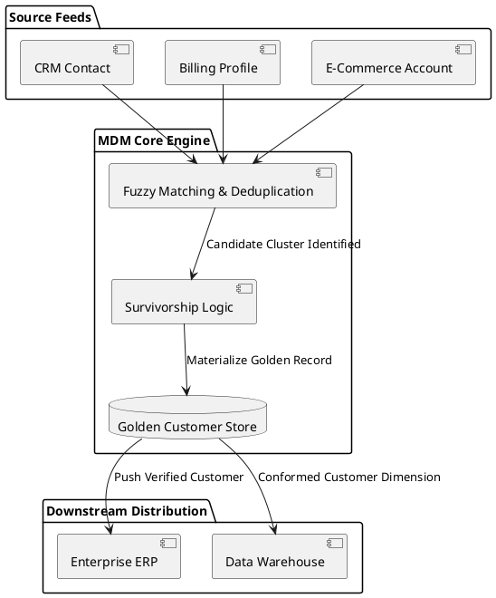

# Master Data Management (MDM) & Golden Record Architecture

Entity resolution and master data governance architecture detailing deduplication, survivorship rules, and authoritative golden record distribution.

## Mermaid Architecture Diagram

## PlantUML Specification

## Architectural Design Considerations

* **Deterministic vs Probabilistic Matching**: Use deterministic matching on unique keys (Tax ID, National ID) and probabilistic fuzzy matching on names and addresses.
* **Survivorship Rule Definition**: Specify field-level survivorship rules (e.g., billing address always wins from Billing; legal name always wins from Identity Verification).
* **Data Steward Exception Queue**: Route ambiguous matches (confidence scores between 70% and 85%) to human data steward review consoles.

## Related Documentation & Patterns

* [Operational Data Store](file:///d:/company/products/enterprise-architecture-handbook/17-diagrams/data-flow/operational-data-store.md)
* [Data Lineage](file:///d:/company/products/enterprise-architecture-handbook/17-diagrams/data-flow/data-lineage.md)
* [Data Governance Checklist](file:///d:/company/products/enterprise-architecture-handbook/17-diagrams/data-flow/checklists.md)
