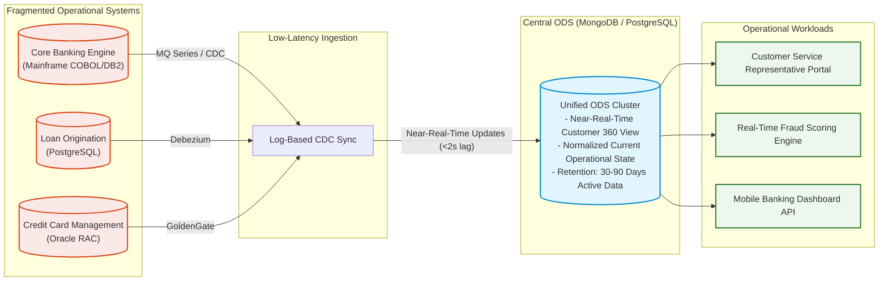
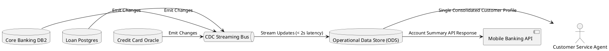

# Operational Data Store (ODS) Integration Architecture

Near-real-time operational consolidation store bridging fragmented operational transaction engines and analytical reporting platforms.

## Mermaid Architecture Diagram

## PlantUML Specification

## Architectural Design Considerations

* **Operational Focus**: An ODS is optimized for transactional lookup queries (Customer 360) rather than multi-year historical trend aggregation.
* **Low Replication Latency**: Ensure synchronization lag between core transactional databases and the ODS remains strictly under 2 seconds.
* **Read Offloading**: Direct high-volume operational queries away from legacy core transactional mainframes to preserve core transaction throughput.

## Related Documentation & Patterns

* [Change Data Capture](file:///d:/company/products/enterprise-architecture-handbook/17-diagrams/data-flow/cdc.md)
* [Data Lake](file:///d:/company/products/enterprise-architecture-handbook/17-diagrams/data-flow/data-lake.md)
* [Master Data Management](file:///d:/company/products/enterprise-architecture-handbook/17-diagrams/data-flow/master-data.md)
