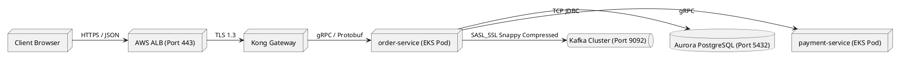

# Physical Data Flow Diagram & Transport Protocols

Concrete infrastructure-level data flow detailing wire protocols, network serialization, transport ports, and persistent storage engines.

## Mermaid Architecture Diagram

```mermaid
graph LR
    subgraph ClientTier ["Client Application Tier"]
        Client["React Web App (Browser)"]
    end

    subgraph IngressTier ["Ingress & Gateway Tier"]
        ALB["AWS Application Load Balancer<br/>[Port 443 / TLS 1.3]"]
        Kong["Kong API Gateway<br/>[Docker Container]"]
        Client -->|"HTTPS / HTTP/2<br/>JSON Payload"| ALB
        ALB -->|"mTLS 1.3"| Kong
    end

    subgraph MicroserviceTier ["Service Mesh (EKS Cluster)"]
        OrderSvc["order-service Pod<br/>[Go 1.22 runtime]"]
        PaymentSvc["payment-service Pod<br/>[Spring Boot 3]"]
        
        Kong -->|"gRPC / HTTP/2<br/>Protobuf"| OrderSvc
        OrderSvc -->|"gRPC (Port 9090)<br/>mTLS"| PaymentSvc
    end

    subgraph EventAndDataTier ["Streaming & Persistence Tier"]
        Kafka["Kafka Broker Cluster<br/>[Port 9092 / SASL_SSL / Snappy]"]
        Aurora[(Amazon Aurora PostgreSQL 16<br/>[Port 5432 / TLS])]
        Redis[("Redis Cluster 7.2<br/>[Port 6379 / TLS]")]

        OrderSvc -->|"JDBC connection pool"| Aurora
        OrderSvc -->|"Async Produce<br/>Topic: orders.v1"| Kafka
        OrderSvc -->|"RESP Protocol"| Redis
    end

    classDef ing fill:#fff3e0,stroke:#e65100,stroke-width:2px;
    classDef svc fill:#e8f5e9,stroke:#2e7d32,stroke-width:2px;
    classDef dat fill:#e1f5fe,stroke:#0288d1,stroke-width:2px;
    class ALB,Kong ing;
    class OrderSvc,PaymentSvc svc;
    class Kafka,Aurora,Redis dat;
```

## PlantUML Specification



## Architectural Design Considerations

* **Wire Protocol Efficiency**: Use binary serialization protocols (Protobuf, Avro) over gRPC for internal East-West traffic to minimize serialization latency and CPU overhead.
* **Connection Pooling**: Enforce bounded connection pooling (e.g., HikariCP, PgBouncer) between microservices and relational databases to prevent connection exhaustion.
* **Encryption in Flight**: Enforce TLS 1.3 or SASL_SSL across all physical hops, including intra-VPC database queries and Kafka broker traffic.

## Related Documentation & Patterns

* [Logical Data Flow](file:///d:/company/products/enterprise-architecture-handbook/17-diagrams/data-flow/logical-data-flow.md)
* [Streaming Architecture](file:///d:/company/products/enterprise-architecture-handbook/17-diagrams/data-flow/streaming.md)
* [Network Security](file:///d:/company/products/enterprise-architecture-handbook/17-diagrams/security/network-security.md)
