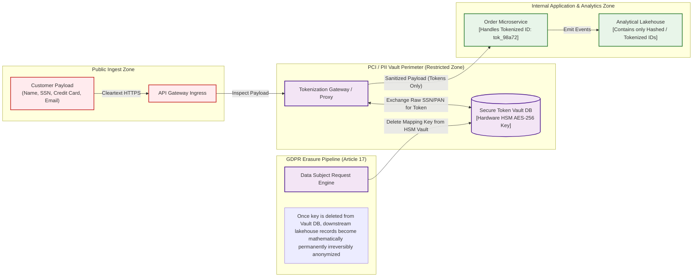
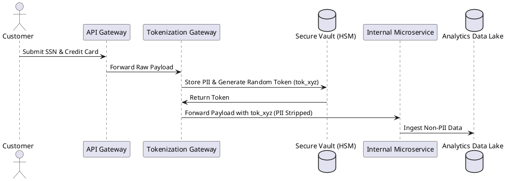

# PII Isolation, Tokenization & Data Redaction Flow

Compliance architecture detailing field-level encryption, tokenization gateways, and irreversible pseudonymization across enterprise data pipelines.

## Mermaid Architecture Diagram

## PlantUML Specification

## Architectural Design Considerations

* **Minimization of Scope**: Isolate raw PII storage to a single dedicated vault subnet; prevent raw identifiers from propagating into general application databases.
* **Format-Preserving Encryption (FPE)**: Use FPE or format-matching tokens to avoid breaking downstream relational schemas and validation regexes.
* **Cryptographic Erasure (Crypto-Shredding)**: Fulfill GDPR Right-to-be-Forgotten requests by deleting the encryption key for a specific subject rather than executing expensive mutations across multi-terabyte Parquet files.

## Related Documentation & Patterns

* [Data Classification](file:///d:/company/products/enterprise-architecture-handbook/17-diagrams/security/data-classification.md)
* [Data Lineage](file:///d:/company/products/enterprise-architecture-handbook/17-diagrams/data-flow/data-lineage.md)
* [Encryption](file:///d:/company/products/enterprise-architecture-handbook/17-diagrams/security/encryption.md)
