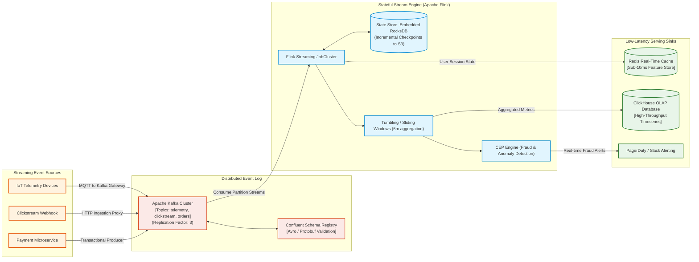
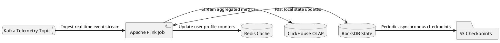

# Real-Time Stream Processing Architecture (Flink & Kafka)

Sub-second streaming analytics pipeline utilizing Apache Kafka for durable message ingestion, Apache Flink for stateful stream computations, and real-time sinks.

## Mermaid Architecture Diagram

## PlantUML Specification

## Architectural Design Considerations

* **Exactly-Once Semantics (EOS)**: Combine Kafka two-phase commit producers with Flink Chandy-Lamport distributed checkpointing to guarantee EOS end-to-end.
* **State Management**: Leverage local RocksDB state storage backed by incremental asynchronous snapshots to cloud object storage (S3).
* **Late Data Handling**: Configure watermarks and allowed lateness windows to correctly handle out-of-order and delayed mobile/IoT events.

## Related Documentation & Patterns

* [Event-Driven Data Flow](file:///d:/company/products/enterprise-architecture-handbook/17-diagrams/data-flow/event-driven.md)
* [Change Data Capture](file:///d:/company/products/enterprise-architecture-handbook/17-diagrams/data-flow/cdc.md)
* [Physical Data Flow](file:///d:/company/products/enterprise-architecture-handbook/17-diagrams/data-flow/physical-data-flow.md)
