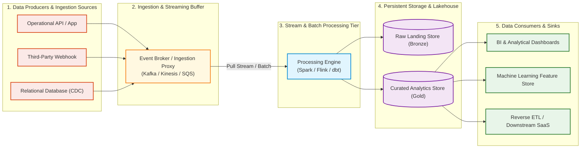
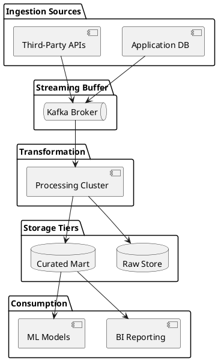

# Enterprise Data-Flow Architecture Diagram Template

Standardized, copy-pasteable starter template for modeling enterprise data flow pipelines from multi-source ingestion through processing, storage tiers, and egress.

## Mermaid Architecture Diagram

## PlantUML Specification

## Architectural Design Considerations

* **Start with the Flow**: Map inputs on the left, processing in the center, storage tiers along the boundary, and consumption sinks on the right.
* **Clarify Guarantees**: Annotate whether connections provide At-Least-Once, At-Most-Once, or Exactly-Once delivery semantics.
* **Standardize Color Tokens**: Coral (#fbe9e7) for sources, Yellow (#fff8e1) for streaming buffers, Blue (#e1f5fe) for compute, Purple (#f3e5f5) for storage, and Green (#e8f5e9) for consumers.

## Related Documentation & Patterns

* [Logical Data Flow](file:///d:/company/products/enterprise-architecture-handbook/17-diagrams/data-flow/logical-data-flow.md)
* [Physical Data Flow](file:///d:/company/products/enterprise-architecture-handbook/17-diagrams/data-flow/physical-data-flow.md)
* [Data Review Checklist](file:///d:/company/products/enterprise-architecture-handbook/17-diagrams/data-flow/checklists.md)
