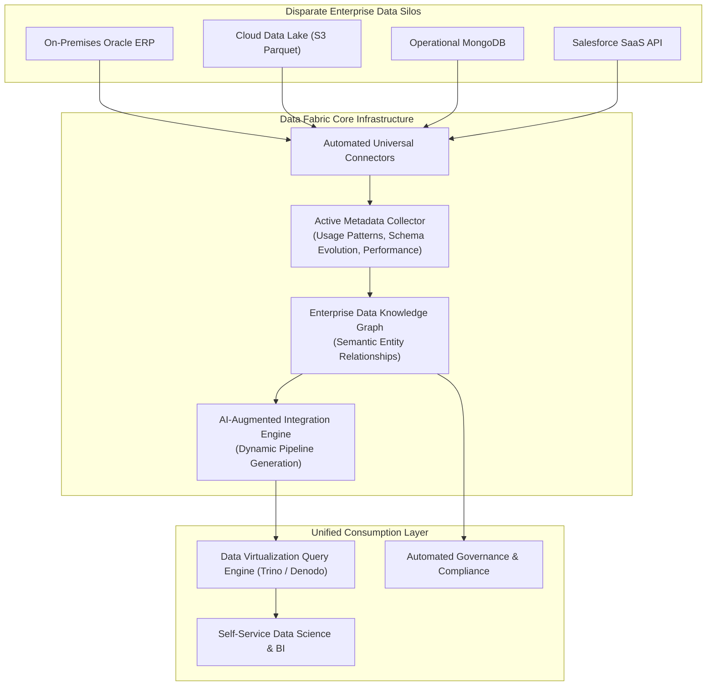
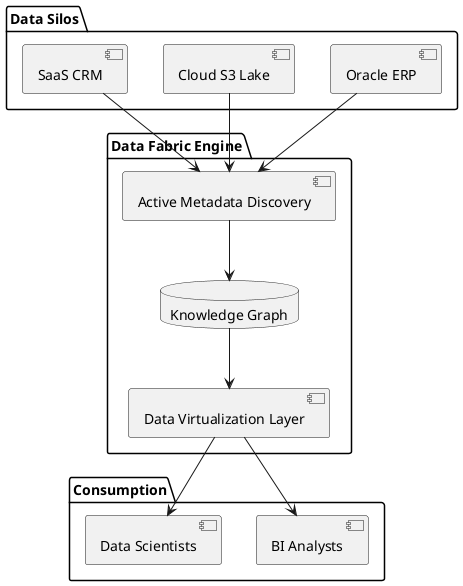

# Data Fabric Architecture (Active Metadata Integration)

Modern Data Fabric architecture utilizing active metadata, automated knowledge graphs, and AI-driven data discovery to connect fragmented data silos.

## Mermaid Architecture Diagram

## PlantUML Specification

## Architectural Design Considerations

* **Active vs Passive Metadata**: Active metadata is continuously analyzed by ML models to dynamically optimize query routing and caching without human intervention.
* **Data Virtualization**: Query data in place across silos without always physically moving or copying it into central warehouses.
* **Data Mesh vs Data Fabric**: Data Mesh is primarily an organizational and cultural paradigm; Data Fabric is primarily a technology-driven architectural paradigm.

## Related Documentation & Patterns

* [Data Mesh](file:///d:/company/products/enterprise-architecture-handbook/17-diagrams/data/data-mesh.md)
* [Data-Flow: Modern Lakehouse](file:///d:/company/products/enterprise-architecture-handbook/17-diagrams/data-flow/lakehouse.md)
* [Data Architecture Checklist](file:///d:/company/products/enterprise-architecture-handbook/17-diagrams/data/checklists.md)
