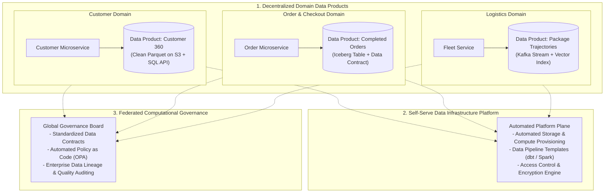
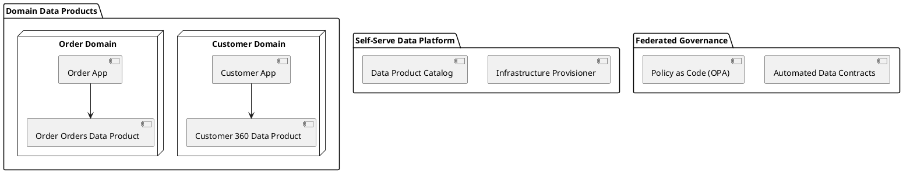

# Data Mesh Architecture (Domain-Oriented Decentralization)

Zhamak Dehghani's Data Mesh paradigm detailing the four core principles: Domain Ownership, Data as a Product, Self-Serve Data Platform, and Federated Computational Governance.

## Mermaid Architecture Diagram

## PlantUML Specification

## Architectural Design Considerations

* **Domain Ownership**: Domain feature teams own analytical data pipelines and data products end-to-end, ending the central data engineering bottleneck.
* **Data as a Product**: Data products must have explicit SLAs, data contracts, documentation, and quality guarantees.
* **Federated Governance**: Standardize interoperability (e.g., Apache Iceberg, open data formats) through automated computational policies.

## Related Documentation & Patterns

* [Data Fabric](file:///d:/company/products/enterprise-architecture-handbook/17-diagrams/data/data-fabric.md)
* [Data-Flow: Lakehouse](file:///d:/company/products/enterprise-architecture-handbook/17-diagrams/data-flow/lakehouse.md)
* [Data-Flow: Data Lineage](file:///d:/company/products/enterprise-architecture-handbook/17-diagrams/data-flow/data-lineage.md)
