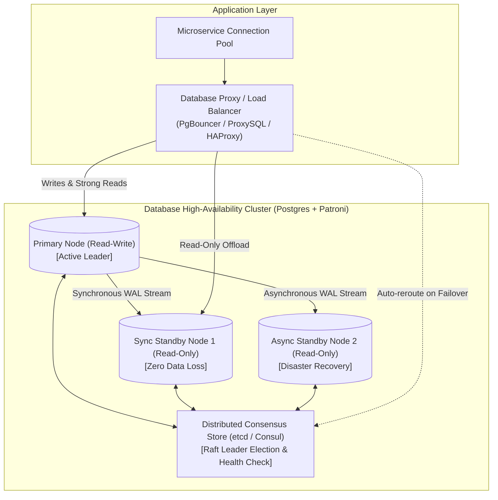
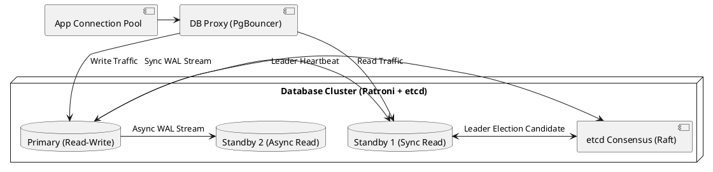

# Database Clustering & High-Availability Architecture

High-availability database clustering architecture detailing leader-follower topologies, Raft/Paxos consensus, automated health probing, and transparent failover.

## Mermaid Architecture Diagram

## PlantUML Specification

## Architectural Design Considerations

* **Split-Brain Mitigation**: Always use an odd number of consensus nodes (minimum 3) to achieve quorum and avoid catastrophic split-brain leader elections.
* **Synchronous vs Asynchronous Replication**: Synchronous replication guarantees zero data loss (RPO=0) at the cost of higher write latency; asynchronous minimizes latency at the risk of slight data loss during hard crashes.
* **Connection Pooling**: Always place connection pooling proxies (PgBouncer) before database clusters to protect backends from client connection spikes.

## Related Documentation & Patterns

* [Database Sharding](file:///d:/company/products/enterprise-architecture-handbook/17-diagrams/data/sharding.md)
* [Database Replication](file:///d:/company/products/enterprise-architecture-handbook/17-diagrams/data/replication.md)
* [Data-Flow: Physical Data Flow](file:///d:/company/products/enterprise-architecture-handbook/17-diagrams/data-flow/physical-data-flow.md)
