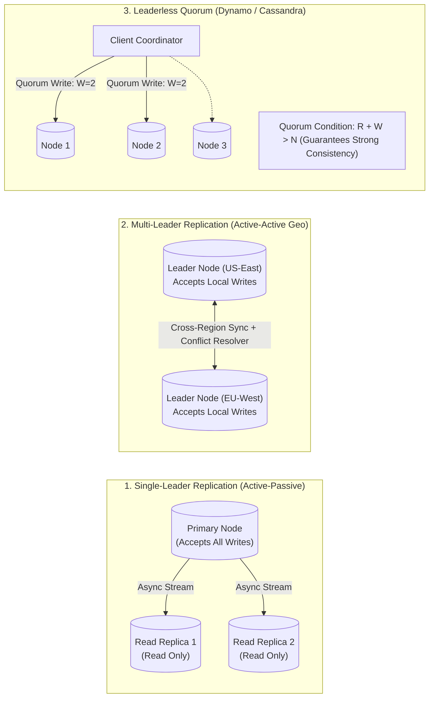
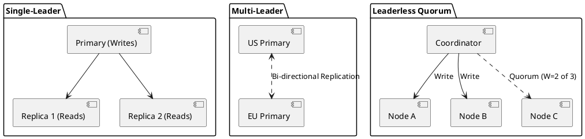

# Database Replication Strategies (Master-Slave vs Multi-Master)

Distributed database replication architectures comparing Single-Leader (Primary-Replica) with Multi-Leader and Leaderless (Dynamo-style) topologies.

## Mermaid Architecture Diagram

## PlantUML Specification

## Architectural Design Considerations

* **Read-After-Write Consistency**: In asynchronous single-leader setups, redirect clients to the primary node for 5-10 seconds after a write to prevent users from seeing stale data.
* **Conflict Resolution in Multi-Leader**: Multi-leader setups inevitably produce write conflicts; plan deterministic conflict resolution strategies (CRDTs or Last-Write-Wins).
* **Quorum Mathematics**: In leaderless systems, ensure $R + W > N$ where $N$ is replication factor, $W$ is write quorum, and $R$ is read quorum to guarantee reading the latest value.

## Related Documentation & Patterns

* [Database Clustering](file:///d:/company/products/enterprise-architecture-handbook/17-diagrams/data/database-clustering.md)
* [Database Sharding](file:///d:/company/products/enterprise-architecture-handbook/17-diagrams/data/sharding.md)
* [Data-Flow: Data Synchronization](file:///d:/company/products/enterprise-architecture-handbook/17-diagrams/data-flow/data-synchronization.md)
