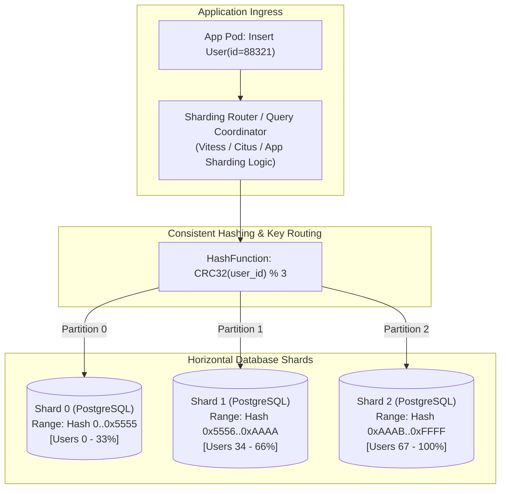
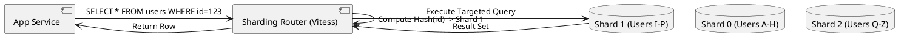

# Database Sharding & Horizontal Partitioning Architecture

Horizontal database sharding architecture detailing hash-based vs range-based partition keys, routing middleware, and re-sharding strategies.

## Mermaid Architecture Diagram

## PlantUML Specification

## Architectural Design Considerations

* **Shard Key Selection**: Choose high-cardinality shard keys (e.g., `user_id`, `tenant_id`) that distribute read and write traffic evenly across all nodes.
* **Cross-Shard Queries**: Avoid queries that do not include the shard key; cross-shard scatter-gather queries introduce massive latency and resource strain.
* **Re-sharding Complexity**: Use consistent hashing algorithms to ensure that adding new shards requires migrating only $K/N$ keys rather than reshuffling the entire database.

## Related Documentation & Patterns

* [Database Clustering](file:///d:/company/products/enterprise-architecture-handbook/17-diagrams/data/database-clustering.md)
* [Database Replication](file:///d:/company/products/enterprise-architecture-handbook/17-diagrams/data/replication.md)
* [Data Architecture Checklist](file:///d:/company/products/enterprise-architecture-handbook/17-diagrams/data/checklists.md)
