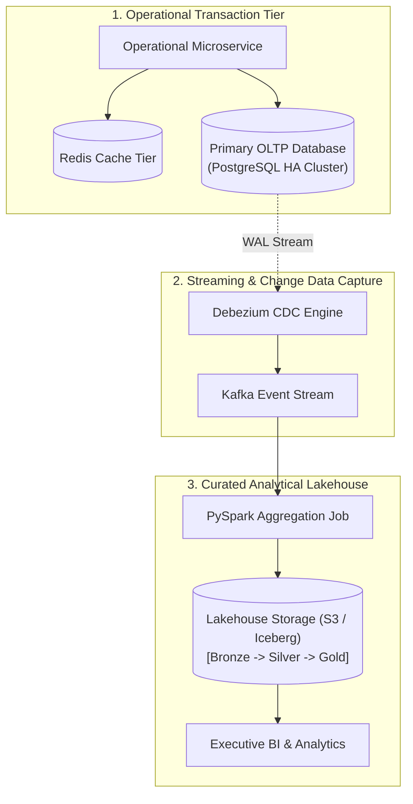
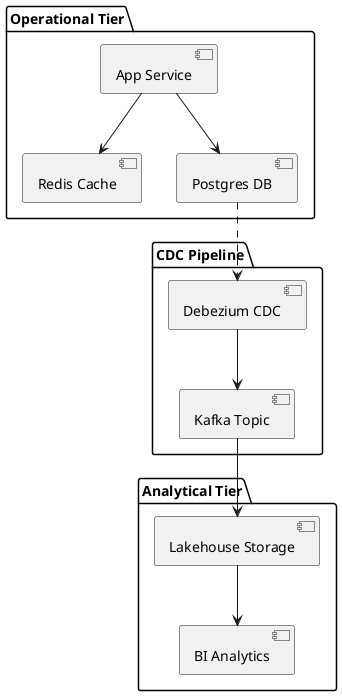

# Data Architecture Starter Template

Production-ready boilerplate template for modeling enterprise data topologies, operational databases, caching layers, and analytical pipelines.

## Mermaid Architecture Diagram

## PlantUML Specification

## Architectural Design Considerations

* **Separation of OLTP and OLAP**: Never run complex reporting queries against the operational OLTP database; stream mutations to an analytical store.
* **Standard Starting Baseline**: Use this template when documenting the complete data lifecycle for an enterprise solution.
* **Annotate Storage Formats**: Clearly state whether tables are row-oriented (B-Tree) or columnar (Parquet/Iceberg).

## Related Documentation & Patterns

* [Data Mesh](file:///d:/company/products/enterprise-architecture-handbook/17-diagrams/data/data-mesh.md)
* [Database Clustering](file:///d:/company/products/enterprise-architecture-handbook/17-diagrams/data/database-clustering.md)
* [Data Architecture Checklist](file:///d:/company/products/enterprise-architecture-handbook/17-diagrams/data/checklists.md)
