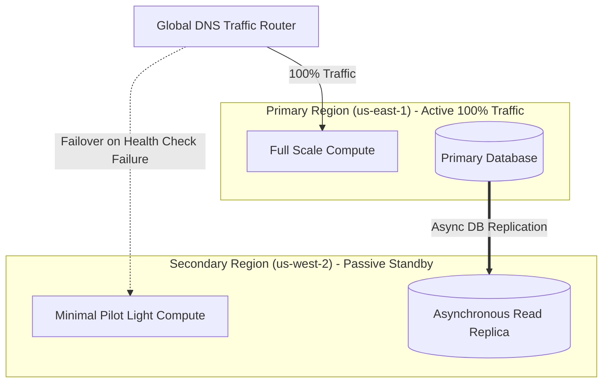

# Active-Passive Warm Standby Deployment Topology

```mermaid
flowchart TD
    DNS["Global DNS Traffic Router"]
    subgraph PrimaryRegion["Primary Region (us-east-1) - Active 100% Traffic"]
        App1["Full Scale Compute"]
        DB1[("Primary Database")]
    end
    subgraph SecondaryRegion["Secondary Region (us-west-2) - Passive Standby"]
        App2["Minimal Pilot Light Compute"]
        DB2[("Asynchronous Read Replica")]
    end

    DNS -->|100% Traffic| App1
    DNS -.->|Failover on Health Check Failure| App2
    DB1 == Async DB Replication ==> DB2
```
