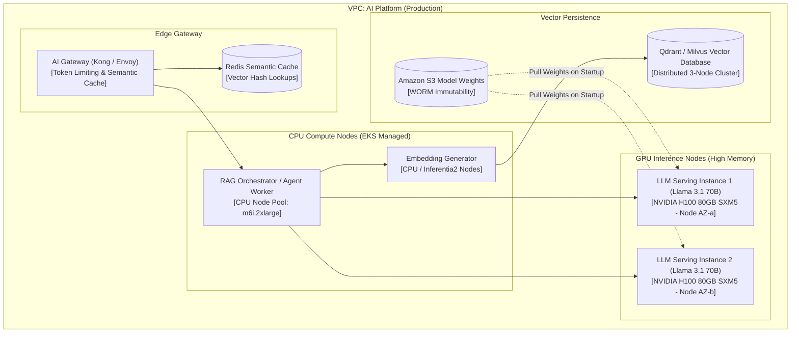

# AI Platform & GPU Inference Cluster Deployment Topology

Shows the physical separation between CPU control plane, GPU model inference node pools, vector search, and model artifact registries.

```mermaid
flowchart TD
    subgraph VPC["VPC: AI Platform (Production)"]
        subgraph Ingress["Edge Gateway"]
            AIGateway["AI Gateway (Kong / Envoy)
[Token Limiting & Semantic Cache]"]
            RedisCache[("Redis Semantic Cache
[Vector Hash Lookups]")]
        end

        subgraph GeneralCompute["CPU Compute Nodes (EKS Managed)"]
            OrchestratorPod["RAG Orchestrator / Agent Worker
[CPU Node Pool: m6i.2xlarge]"]
            EmbeddingPod["Embedding Generator
[CPU / Inferentia2 Nodes]"]
        end

        subgraph GPUInference["GPU Inference Nodes (High Memory)"]
            vLLMPod1["LLM Serving Instance 1 (Llama 3.1 70B)
[NVIDIA H100 80GB SXM5 - Node AZ-a]"]
            vLLMPod2["LLM Serving Instance 2 (Llama 3.1 70B)
[NVIDIA H100 80GB SXM5 - Node AZ-b]"]
        end

        subgraph VectorStore["Vector Persistence"]
            QdrantCluster[("Qdrant / Milvus Vector Database
[Distributed 3-Node Cluster]")]
            S3ModelStore[("Amazon S3 Model Weights
[WORM Immutability]")]
        end
    end

    AIGateway --> RedisCache
    AIGateway --> OrchestratorPod
    OrchestratorPod --> EmbeddingPod
    EmbeddingPod --> QdrantCluster
    OrchestratorPod --> vLLMPod1
    OrchestratorPod --> vLLMPod2
    S3ModelStore -.->|Pull Weights on Startup| vLLMPod1
    S3ModelStore -.->|Pull Weights on Startup| vLLMPod2
```
