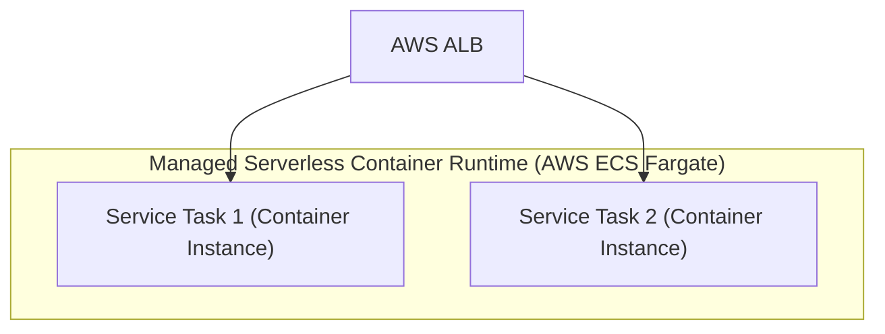

# Managed Container Platform Deployment (AWS ECS / Cloud Run)

```mermaid
flowchart TD
    subgraph ManagedContainers["Managed Serverless Container Runtime (AWS ECS Fargate)"]
        Task1["Service Task 1 (Container Instance)"]
        Task2["Service Task 2 (Container Instance)"]
    end
    ALB["AWS ALB"] --> Task1
    ALB --> Task2
```
