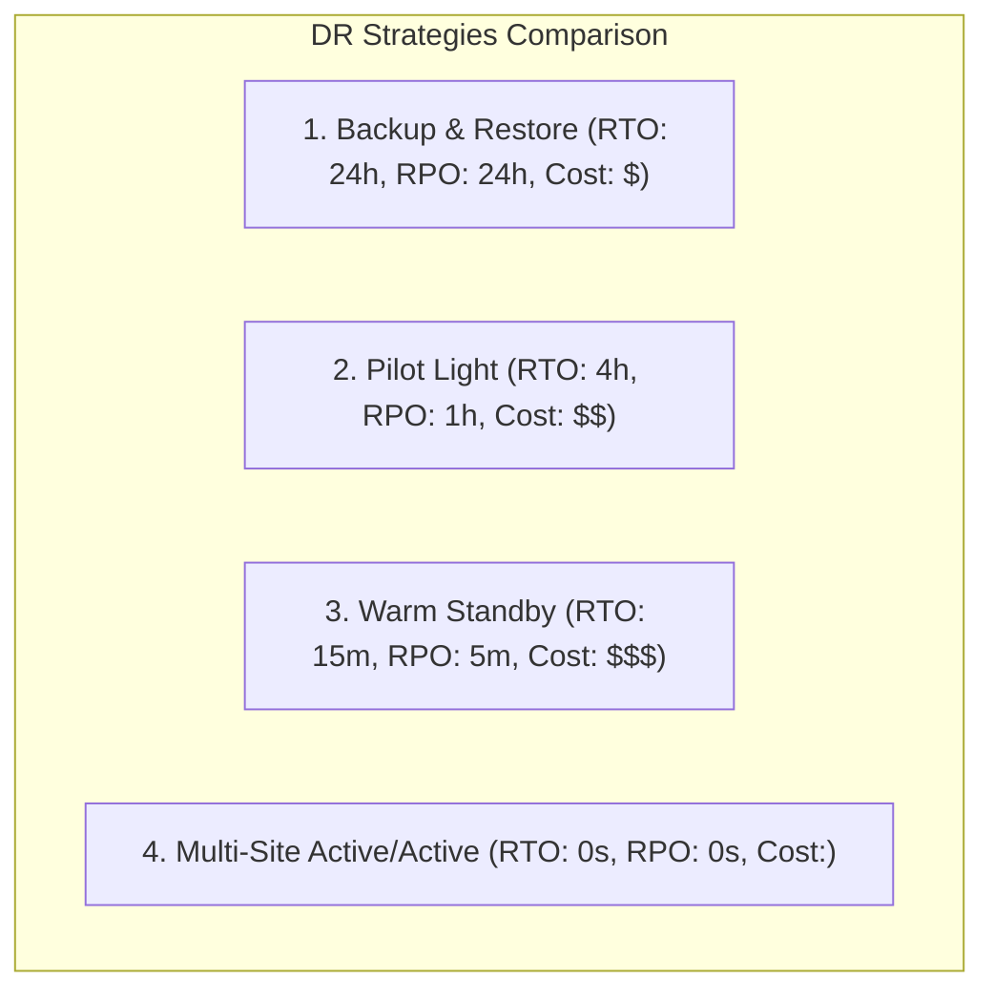

# Disaster Recovery Topologies: Backup vs Pilot Light vs Multi-Site

```mermaid
flowchart TD
    subgraph Strat["DR Strategies Comparison"]
        Backup["1. Backup & Restore (RTO: 24h, RPO: 24h, Cost: $)"]
        PilotLight["2. Pilot Light (RTO: 4h, RPO: 1h, Cost: $$)"]
        WarmStandby["3. Warm Standby (RTO: 15m, RPO: 5m, Cost: $$$)"]
        MultiSite["4. Multi-Site Active/Active (RTO: 0s, RPO: 0s, Cost: $$$$)"]
    end
```
