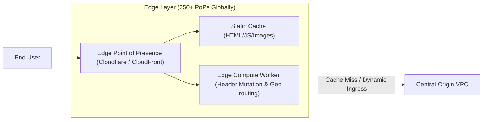

# Global Edge Compute & CDN Deployment Topology

```mermaid
flowchart LR
    User["End User"] --> PoP["Edge Point of Presence (Cloudflare / CloudFront)"]
    subgraph Edge["Edge Layer (250+ PoPs Globally)"]
        PoP --> StaticCache["Static Cache (HTML/JS/Images)"]
        PoP --> EdgeWorker["Edge Compute Worker (Header Mutation & Geo-routing)"]
    end
    EdgeWorker -->|Cache Miss / Dynamic Ingress| Origin["Central Origin VPC"]
```
