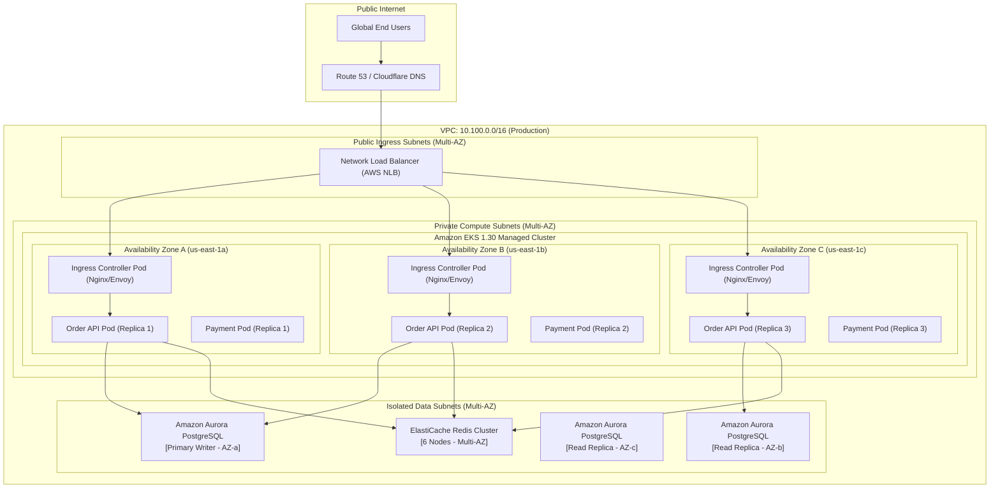

# Production Kubernetes Multi-AZ Deployment Topology

Illustrates an enterprise-grade Kubernetes cluster topology deployed across three Availability Zones with separated system and application node pools.

