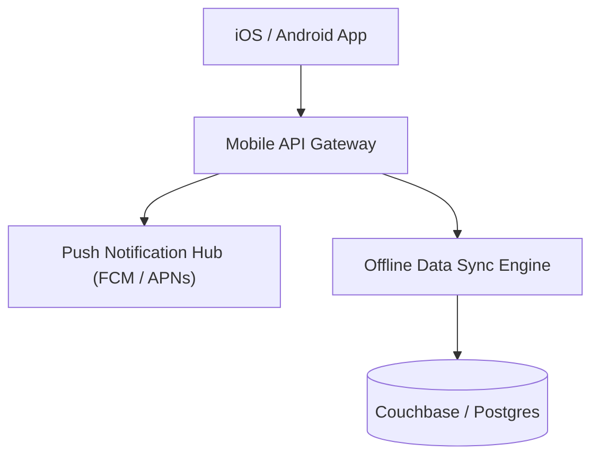

# Mobile Application Backend Deployment Topology

```mermaid
flowchart TD
    Mobile["iOS / Android App"] --> Gateway["Mobile API Gateway"]
    Gateway --> PushSvc["Push Notification Hub (FCM / APNs)"]
    Gateway --> SyncSvc["Offline Data Sync Engine"]
    SyncSvc --> DB[("Couchbase / Postgres")]
```
