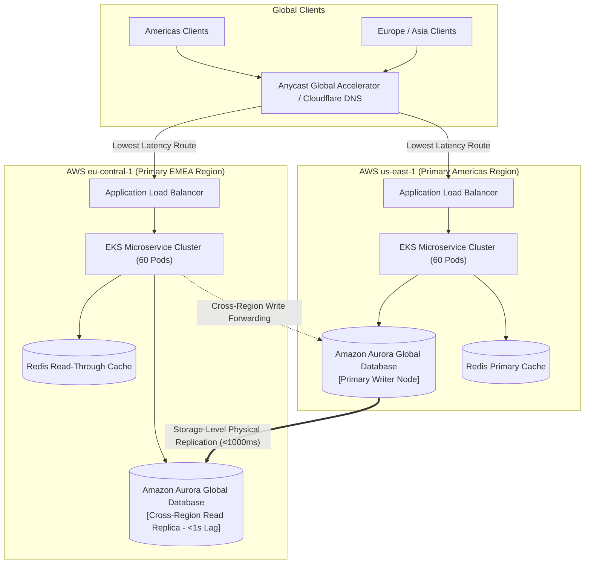

# Multi-Region Active-Active Deployment Topology

Illustrates a globally distributed, active-active deployment topology with latency-based DNS routing and multi-region database replication.

```mermaid
flowchart TD
    subgraph Clients["Global Clients"]
        US_Users["Americas Clients"]
        EU_Users["Europe / Asia Clients"]
        GeoDNS["Anycast Global Accelerator / Cloudflare DNS"]
    end

    subgraph RegionUS["AWS us-east-1 (Primary Americas Region)"]
        ALB_US["Application Load Balancer"]
        App_US["EKS Microservice Cluster (60 Pods)"]
        DB_US[("Amazon Aurora Global Database
[Primary Writer Node]")]
        Cache_US[("Redis Primary Cache")]
    end

    subgraph RegionEU["AWS eu-central-1 (Primary EMEA Region)"]
        ALB_EU["Application Load Balancer"]
        App_EU["EKS Microservice Cluster (60 Pods)"]
        DB_EU[("Amazon Aurora Global Database
[Cross-Region Read Replica - <1s Lag]")]
        Cache_EU[("Redis Read-Through Cache")]
    end

    US_Users --> GeoDNS
    EU_Users --> GeoDNS

    GeoDNS -->|Lowest Latency Route| ALB_US
    GeoDNS -->|Lowest Latency Route| ALB_EU

    ALB_US --> App_US
    ALB_EU --> App_EU

    App_US --> DB_US
    App_US --> Cache_US

    App_EU --> DB_EU
    App_EU --> Cache_EU

    App_EU -.->|Cross-Region Write Forwarding| DB_US
    DB_US == Storage-Level Physical Replication (<1000ms) ==> DB_EU
```
