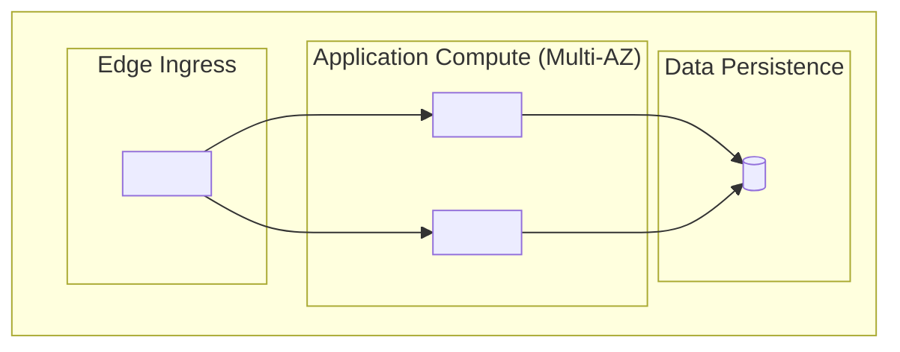

# Deployment Diagram Starter Template

```mermaid
flowchart TD
    subgraph Cloud["<Cloud Provider / Region>"]
        subgraph Edge["Edge Ingress"]
            LB["<Load Balancer>"]
        end
        subgraph AppTier["Application Compute (Multi-AZ)"]
            Node1["<Compute Node 1>"]
            Node2["<Compute Node 2>"]
        end
        subgraph DataTier["Data Persistence"]
            DB[("<Database Primary>")]
        end
    end

    LB --> Node1
    LB --> Node2
    Node1 --> DB
    Node2 --> DB
```
