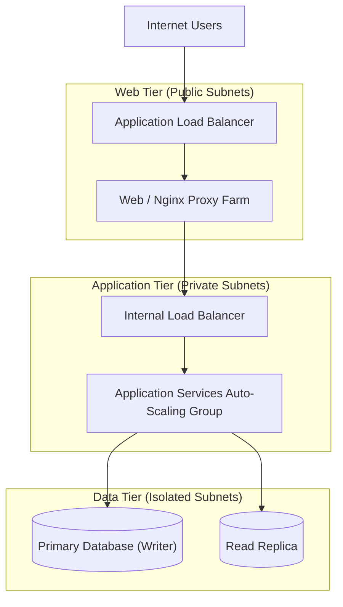

# Classic Three-Tier Enterprise Deployment

```mermaid
flowchart TD
    subgraph Edge["Web Tier (Public Subnets)"]
        ALB["Application Load Balancer"]
        WebServers["Web / Nginx Proxy Farm"]
    end
    subgraph AppTier["Application Tier (Private Subnets)"]
        InternalLB["Internal Load Balancer"]
        AppInstances["Application Services Auto-Scaling Group"]
    end
    subgraph DataTier["Data Tier (Isolated Subnets)"]
        DBPrimary[("Primary Database (Writer)")]
        DBReplica[("Read Replica")]
    end

    Internet["Internet Users"] --> ALB --> WebServers
    WebServers --> InternalLB --> AppInstances
    AppInstances --> DBPrimary
    AppInstances --> DBReplica
```
