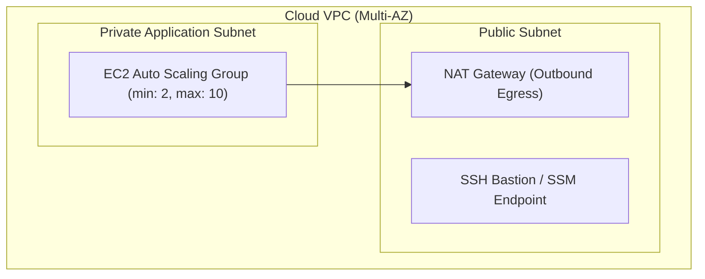

# Virtual Machine Auto-Scaling Group Deployment

```mermaid
flowchart TD
    subgraph Cloud["Cloud VPC (Multi-AZ)"]
        subgraph Public["Public Subnet"]
            Bastion["SSH Bastion / SSM Endpoint"]
            NAT["NAT Gateway (Outbound Egress)"]
        end
        subgraph Private["Private Application Subnet"]
            ASG["EC2 Auto Scaling Group (min: 2, max: 10)"]
        end
    end
    ASG --> NAT
```
