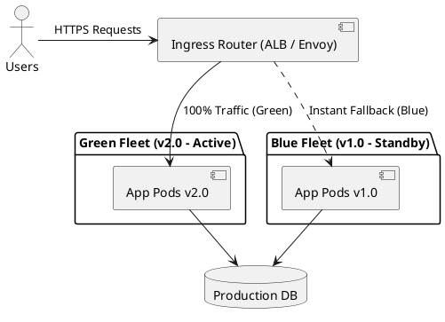

# Blue-Green Zero-Downtime Deployment Topology

Production blue-green deployment topology maintaining two identical hosting environments, enabling instant cutover and zero-downtime rollbacks via router switching.

## Mermaid Architecture Diagram

```mermaid
graph TD
    subgraph IngressTier ["Edge Ingress & Router"]
        InternetUsers["External User Traffic"]
        EdgeRouter["Ingress Controller / Load Balancer<br/>[Active Route: points to Green v2]"]
        InternetUsers --> EdgeRouter
    end

    subgraph BlueEnvironment ["Blue Environment (Version 1.0 - Idle / Fallback)"]
        BluePods["Application Pods (v1.0.0)<br/>- 10 Replica Pods Active<br/>- Inactive Traffic State"]
    end

    subgraph GreenEnvironment ["Green Environment (Version 2.0 - Active Production)"]
        GreenPods["Application Pods (v2.0.0)<br/>- 10 Replica Pods Active<br/>- Serving 100% Live Traffic"]
    end

    subgraph SharedPersistence ["Shared Production Persistence"]
        ProdDB[(Shared PostgreSQL Database Cluster<br/>[Backward & Forward Compatible Schema])]
    end

    EdgeRouter -.->|"Instant Rollback Route (if v2 fails)"| BluePods
    EdgeRouter -->|"100% Active Production Traffic"| GreenPods
    BluePods --> ProdDB
    GreenPods --> ProdDB
```

## PlantUML Specification



## Architectural Design Considerations

* **Database Compatibility**: The shared database schema must support both Blue and Green versions simultaneously (Expand-Contract / Parallel-Change pattern).
* **Instant Rollback**: If health checks or error metrics spike on the newly activated Green environment, flipping the router back to Blue takes sub-seconds.
* **Cost Consideration**: Requires doubling compute capacity during release windows; decommission or spin down idle environments post-verification to optimize cost.

## Related Documentation & Patterns

* [Canary Deployment](file:///d:/company/products/enterprise-architecture-handbook/17-diagrams/devops/canary.md)
* [GitOps Pipeline](file:///d:/company/products/enterprise-architecture-handbook/17-diagrams/devops/gitops-pipeline.md)
* [Deployment: Kubernetes](file:///d:/company/products/enterprise-architecture-handbook/17-diagrams/deployment/kubernetes.md)
