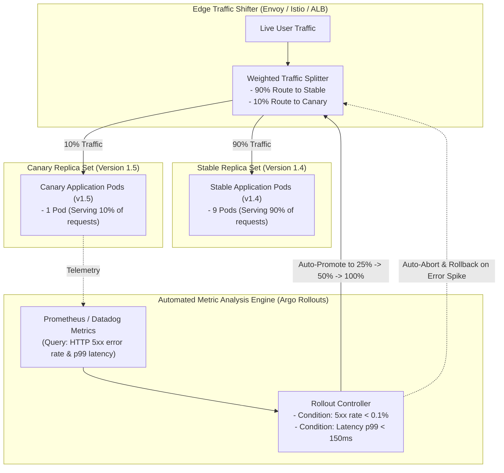
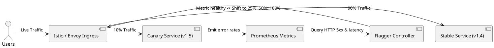

# Canary Progressive Delivery Architecture (Argo Rollouts / Flagger)

Automated progressive delivery architecture shifting a small fraction of live production traffic to a new version, monitoring metrics, and auto-promoting or aborting.

## Mermaid Architecture Diagram

## PlantUML Specification

## Architectural Design Considerations

* **Automated Rollback Criteria**: Define strict statistical thresholds (e.g., error rate > 0.5% over 5 consecutive minutes) that automatically abort the canary without human intervention.
* **Synthetic vs Real Traffic**: Real canary evaluation requires authentic user traffic; synthetic testing cannot capture all production edge cases.
* **Targeted Canaries**: Use HTTP request headers (e.g., `X-Internal-Beta: true`) to route canary traffic to internal employees before exposing it to public users.

## Related Documentation & Patterns

* [Blue-Green Deployment](file:///d:/company/products/enterprise-architecture-handbook/17-diagrams/devops/blue-green.md)
* [GitOps Pipeline](file:///d:/company/products/enterprise-architecture-handbook/17-diagrams/devops/gitops-pipeline.md)
* [Observability Pipeline](file:///d:/company/products/enterprise-architecture-handbook/17-diagrams/devops/observability-pipeline.md)
