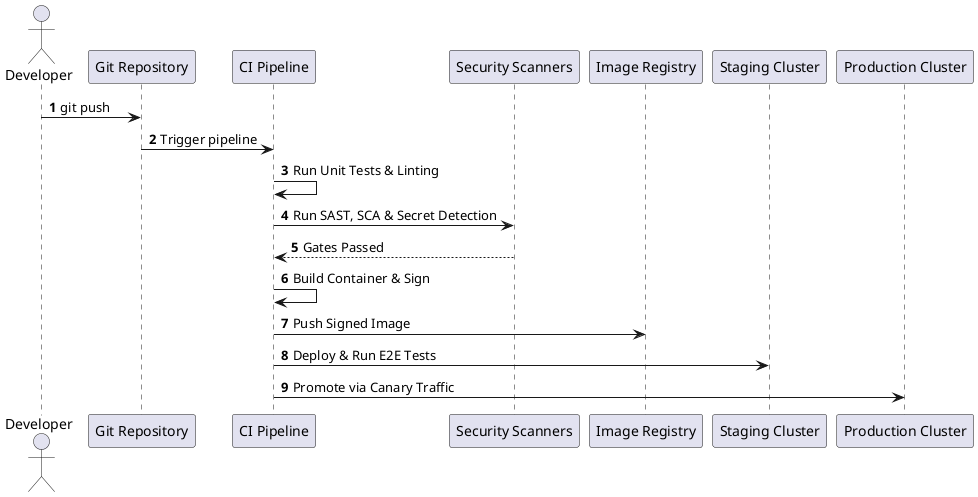

# Enterprise Continuous Integration & Delivery (CI/CD) Pipeline

Comprehensive enterprise CI/CD delivery lifecycle detailing automated quality gates, security scanning (SAST/SCA), environment promotion, and release management.

## Mermaid Architecture Diagram

```mermaid
graph LR
    subgraph Stage1Commit ["1. Commit Phase"]
        DevCommit["Developer Git Commit"]
        Lint["Linting & Unit Tests"]
        DevCommit --> Lint
    end

    subgraph Stage2Security ["2. Security & Compliance Gates"]
        SAST["SAST Scan (SonarQube)"]
        SCA["Dependency Scan (Snyk)"]
        SecretScan["Secret Detection (Gitleaks)"]
        Lint --> SAST
        Lint --> SCA
        Lint --> SecretScan
    end

    subgraph Stage3Build ["3. Package & Containerize"]
        BuildDocker["Build Container Image"]
        SignDocker["Cosign Keyless Signing"]
        PushRegistry["Push to OCI Registry"]
        SAST --> BuildDocker
        SCA --> BuildDocker
        SecretScan --> BuildDocker
        BuildDocker --> SignDocker
        SignDocker --> PushRegistry
    end

    subgraph Stage4Deploy ["4. Progressive Deployment"]
        DeployStg["Deploy to Staging"]
        E2ETest["Automated Integration & E2E Tests"]
        ApprovalGate["Change Advisory Board (CAB) Sign-off"]
        DeployProd["Deploy to Production (Canary)"]

        PushRegistry --> DeployStg
        DeployStg --> E2ETest
        E2ETest --> ApprovalGate
        ApprovalGate --> DeployProd
    end
```

## PlantUML Specification

## Architectural Design Considerations

* **Fast Feedback Loop**: Keep Stage 1 (Commit & Unit Tests) under 5 minutes to maintain high developer velocity.
* **Strict Quality Gates**: Block pull request merges automatically if unit test coverage drops below 80% or if high-severity CVEs are detected.
* **Immutable Artifacts**: Build and sign container images once during CI; promote the exact same cryptographic image digest across Staging and Production.

## Related Documentation & Patterns

* [GitOps Pipeline](file:///d:/company/products/enterprise-architecture-handbook/17-diagrams/devops/gitops-pipeline.md)
* [Blue-Green Deployment](file:///d:/company/products/enterprise-architecture-handbook/17-diagrams/devops/blue-green.md)
* [Security: Supply Chain](file:///d:/company/products/enterprise-architecture-handbook/17-diagrams/security/supply-chain.md)
