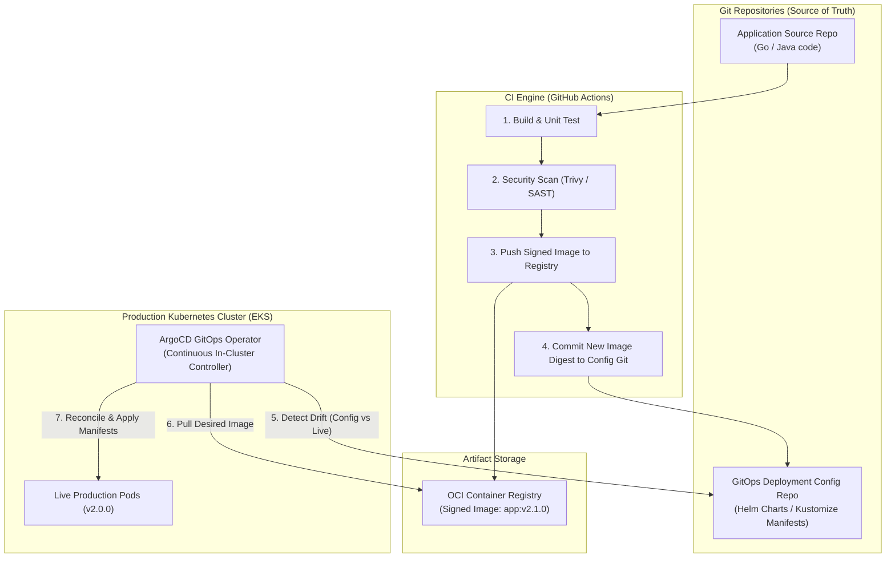

# GitOps Continuous Delivery Architecture (ArgoCD / Flux)

Declarative pull-based GitOps deployment architecture maintaining Git as the single source of truth and continuously reconciling live cluster state against desired state.

## Mermaid Architecture Diagram



## PlantUML Specification

```plantuml
@startuml
actor Developer
participant "Application Git" as appRepo
participant "CI Pipeline" as ci
participant "OCI Registry" as reg
participant "GitOps Config Git" as gitopsRepo
participant "ArgoCD Controller" as argo
node "Kubernetes Cluster" as k8s

Developer -> appRepo : Push commit
appRepo -> ci : Trigger build
ci -> ci : Test & Build Container
ci -> reg : Push signed image
ci -> gitopsRepo : Update Helm value (image tag)
argo -> gitopsRepo : Pull desired state
argo -> k8s : Reconcile cluster state (Pull from registry)
@enduml
```

## Architectural Design Considerations

* **Pull vs Push Deployments**: GitOps agents run inside the cluster and pull manifests, eliminating the need to expose Kubernetes API credentials to external CI runners.
* **Drift Detection & Self-Healing**: ArgoCD automatically detects manual configuration changes made directly to the cluster and immediately reverts them back to the Git baseline.
* **Separation of Repositories**: Keep application source code repositories separate from deployment manifest repositories to prevent infinite CI trigger loops.

## Related Documentation & Patterns

* [CI/CD Flow](file:///d:/company/products/enterprise-architecture-handbook/17-diagrams/devops/ci-cd-flow.md)
* [Canary Deployment](file:///d:/company/products/enterprise-architecture-handbook/17-diagrams/devops/canary.md)
* [Blue-Green Deployment](file:///d:/company/products/enterprise-architecture-handbook/17-diagrams/devops/blue-green.md)
