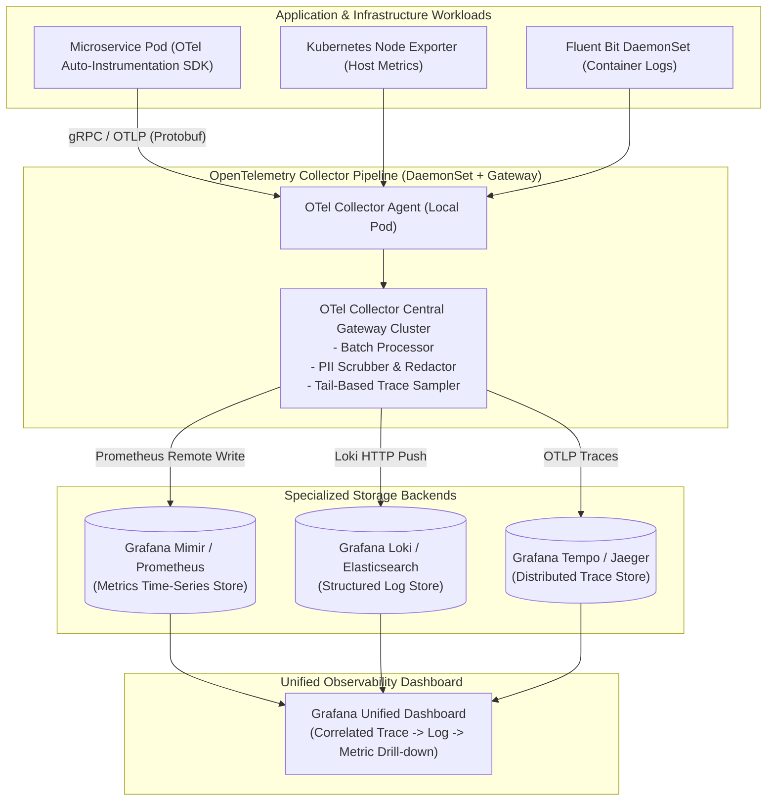
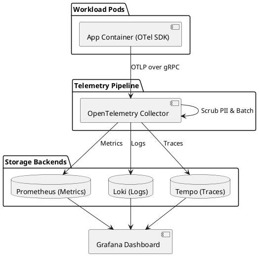

# Enterprise Observability Pipeline (OpenTelemetry, Prometheus & Tempo)

Unified observability telemetry architecture capturing the 3 Pillars (Metrics, Logs, Traces) via OpenTelemetry Collector and routing to specialized backend stores.

## Mermaid Architecture Diagram

## PlantUML Specification

## Architectural Design Considerations

* **Standardized Protocol**: Use OpenTelemetry Protocol (OTLP) exclusively across all services to prevent vendor lock-in to proprietary monitoring agents.
* **Correlation ID / Trace Context**: Propagate W3C Trace Context headers (`traceparent`, `tracestate`) across all HTTP, gRPC, and messaging boundaries.
* **Tail-Based Sampling**: Retain 100% of error traces and slow traces (>2s) while aggressively sampling down high-volume 200 OK happy-path traces to control storage costs.

## Related Documentation & Patterns

* [Canary Deployment](file:///d:/company/products/enterprise-architecture-handbook/17-diagrams/devops/canary.md)
* [DevOps Checklist](file:///d:/company/products/enterprise-architecture-handbook/17-diagrams/devops/checklists.md)
* [Security: Security Monitoring](file:///d:/company/products/enterprise-architecture-handbook/17-diagrams/security/security-monitoring.md)
