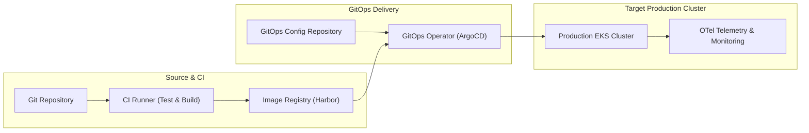
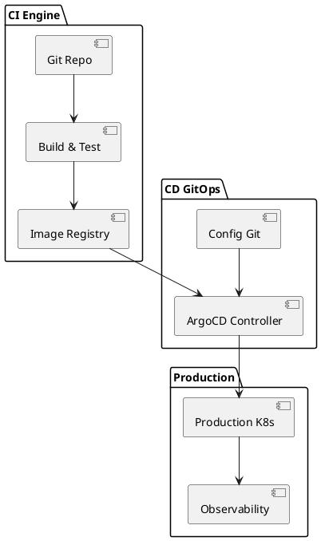

# DevOps Architecture Starter Template

Standardized template for authoring end-to-end continuous integration, delivery pipelines, and production release topologies.

## Mermaid Architecture Diagram

## PlantUML Specification

## Architectural Design Considerations

* **Standard Starting Pipeline**: Copy and adapt this template when documenting CI/CD infrastructure for new microservice projects.
* **Explicit Gateways**: Clearly document automated quality and security gates preceding production promotions.
* **Feedback Loop**: Telemetry flows from production back into developer dashboards.

## Related Documentation & Patterns

* [GitOps Pipeline](file:///d:/company/products/enterprise-architecture-handbook/17-diagrams/devops/gitops-pipeline.md)
* [CI/CD Flow](file:///d:/company/products/enterprise-architecture-handbook/17-diagrams/devops/ci-cd-flow.md)
* [DevOps Review Checklist](file:///d:/company/products/enterprise-architecture-handbook/17-diagrams/devops/checklists.md)
