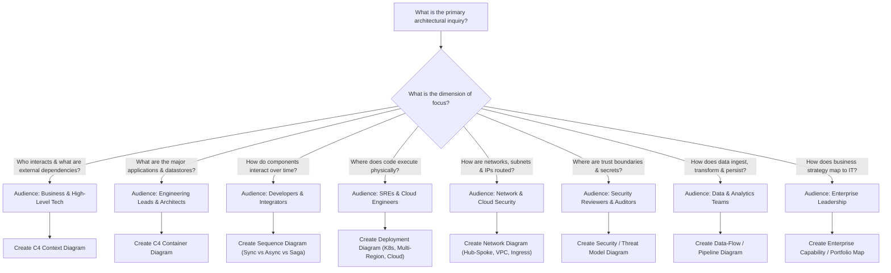

# Architecture Diagram Selection Guide

This guide answers the core architectural question: **"Which diagram should I create to communicate this architectural design or decision?"**

---

## 1. Diagram Decision Matrix

| What You Need to Communicate | Primary Stakeholder | Recommended Diagram | Canonical Directory |
| :--- | :--- | :--- | :--- |
| **System boundaries, users, and external partners** | C-Suite, Product Management, ARB | C4 System Context | [`c4/context.md`](./c4/context.md) |
| **High-level building blocks & datastores** | Engineering Leads, Architects | C4 Container | [`c4/container.md`](./c4/container.md) |
| **Internal structural modularity of a service** | Senior Developers, Tech Leads | C4 Component | [`c4/component.md`](./c4/component.md) |
| **Multi-step transaction or protocol workflow** | Backend Engineers, Security Reviewers | Sequence Diagram | [`sequence/README.md`](./sequence/README.md) |
| **Infrastructure hosting, HA, and scaling topology**| DevOps, Platform Engineers, SREs | Deployment Diagram | [`deployment/README.md`](./deployment/README.md) |
| **Subnets, VPCs, firewalls, and traffic ingress** | Cloud Security, Network Engineers | Network Diagram | [`network/README.md`](./network/README.md) |
| **Trust boundaries, encryption, and authentication**| CISO, Security Engineers, Auditors | Security Architecture | [`security/README.md`](./security/README.md) |
| **Data ingestion, transformation, and storage** | Data Engineers, Compliance Officers | Data-Flow Diagram | [`data-flow/README.md`](./data-flow/README.md) |
| **Cross-enterprise systems & strategic roadmaps** | Enterprise Architects, CIO | Enterprise Landscape | [`enterprise/README.md`](./enterprise/README.md) |
| **LLM pipelines, RAG ingestion, and agent swarms**| AI/ML Engineers, Product Leads | AI Architecture | [`ai/README.md`](./ai/README.md) |

---

## 2. Interactive Selection Tree

