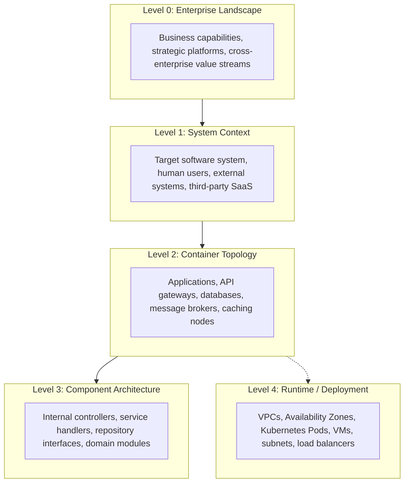

# Enterprise Architecture Diagramming Standard

This standard establishes uniform modeling rules, naming conventions, abstraction boundaries, and layout hygiene across all technical, solution, and enterprise architecture artifacts.

---

## 1. Abstraction Level Governance

Every architecture diagram must declare its primary level of abstraction in the header or title block. Never mix abstractions within the same visual boundary.

### Abstraction Rules
- **Rule 1 (No Technology in Context)**: Do not show databases, ports, or protocols on a Level 1 System Context diagram.
- **Rule 2 (No Code in Containers)**: Do not model classes, functions, or database table columns on a Level 2 Container diagram.
- **Rule 3 (Physical Isolation)**: Keep deployment topology (AWS/Azure infrastructure) separate from logical container interactions.

---

## 2. Naming & Labeling Standards

### Element Naming
- **Never use generic or cryptic identifiers**: Avoid `Server1`, `DB_Old`, `Service_A`, `Worker_2`.
- **Always use explicit, business-functional names**: Use `Order Processing Service`, `Payment Ledger PostgreSQL`, `Customer Identity Provider`.
- **Include Technology Annotations**: On Container and Deployment diagrams, state the concrete technology:
  - Format: `[Functional Name]
[Technology / Framework]`
  - Example: `Inventory Cache
[Redis 7.2 Cluster]`

### Relationship Labeling
Every relationship arrow must define **action, protocol, and synchronicity**:
- **Bad**: `A --> B` (Unlabeled arrow).
- **Poor**: `A -->|data| B` (Ambiguous payload).
- **Good**: `A -->|1. Submit Order (HTTPS/REST / JSON)| B`
- **Good (Async)**: `A -.->|2. Emit OrderCreated (AMQP / Kafka)| B`

---

## 3. Visual Layout & Directional Flow

1. **Directional Consistency**:
   - Primary request flow: **Left-to-Right (`LR`)** or **Top-to-Bottom (`TD`)**.
   - Event emission / telemetry: Visualized orthogonally or at the bottom.
2. **Line Crossing Minimization**:
   - Reorganize node placement to avoid crossing lines ("spaghetti layout").
   - Group related containers into explicit subgraphs (e.g., `subgraph VPC`, `subgraph Security Perimeter`).
3. **Boundary Delineation**:
   - Use distinct borders or colored subgraphs to demarcate:
     - **Trust Boundaries** (Public Internet vs DMZ vs Private Core).
     - **Cloud Accounts / VPCs** (Production vs Staging vs On-Premises).
     - **Domain Boundaries** (Billing Bounded Context vs Order Bounded Context).
