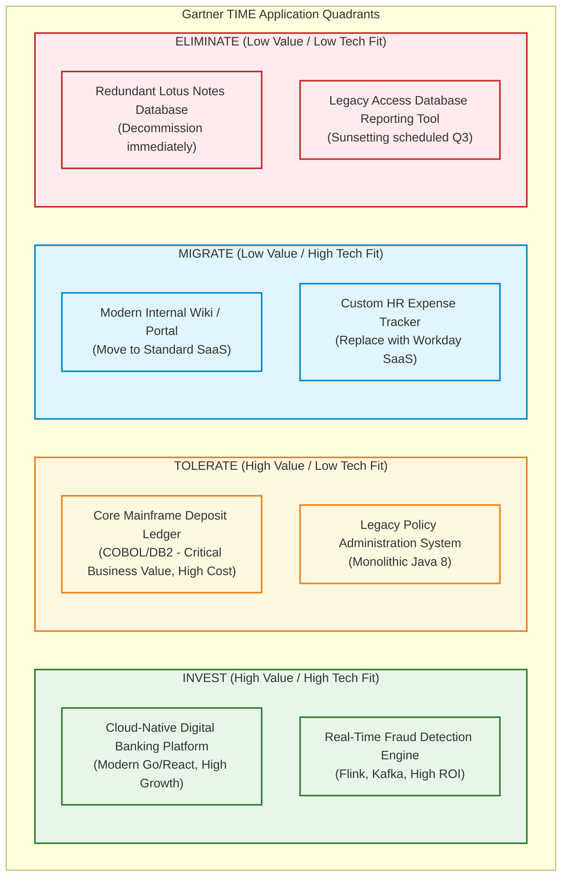
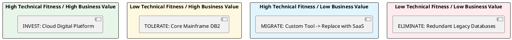

# Application Portfolio Rationalization Matrix (Gartner TIME Model)

Strategic application portfolio assessment mapping enterprise applications across Business Value and Technical Fitness into Tolerate, Invest, Migrate, and Eliminate quadrants.

## Mermaid Architecture Diagram

## PlantUML Specification

## Architectural Design Considerations

* **Objective Decision Framework**: Eliminates emotional bias in software replacement decisions by plotting measurable business metrics against technical code quality.
* **Actionable Roadmap**:
  - **Tolerate**: Maintain system stability; minimize new feature investment; prepare modernization wrappers.
  - **Invest**: Allocate budget, top engineering talent, and expand capability.
  - **Migrate**: Standardize on off-the-shelf commercial SaaS.
  - **Eliminate**: Decommission application, archive data, and reclaim licensing costs.

## Related Documentation & Patterns

* [Business Capability Map](file:///d:/company/products/enterprise-architecture-handbook/17-diagrams/enterprise/business-capability-map.md)
* [Enterprise Integration Landscape](file:///d:/company/products/enterprise-architecture-handbook/17-diagrams/enterprise/integration-landscape.md)
* [Technology Radar](file:///d:/company/products/enterprise-architecture-handbook/17-diagrams/enterprise/technology-radar.md)
