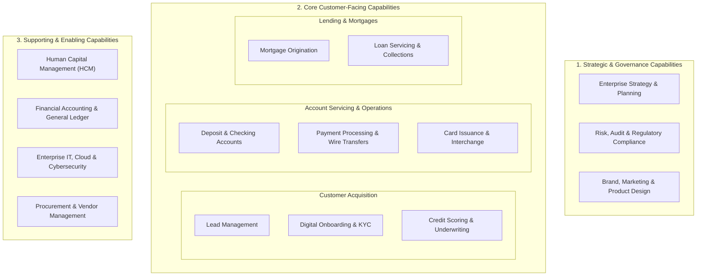
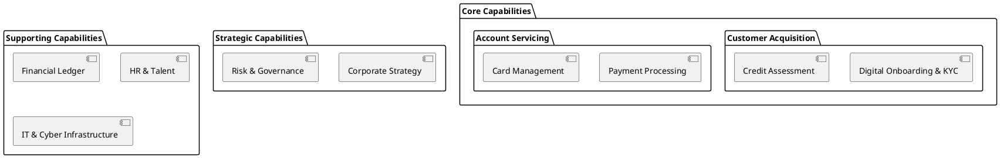

# Enterprise Business Capability Map (L1 / L2 Hierarchy)

Hierarchical Business Capability Map decomposing enterprise capabilities into Strategic, Core Operational, and Supporting tiers independently of organizational hierarchy.

## Mermaid Architecture Diagram

## PlantUML Specification

## Architectural Design Considerations

* **What vs How**: A capability map describes *what* the business does to generate value, not *how* or *which software application* performs it.
* **Stability Over Time**: Business capabilities change rarely (e.g., banks always need 'Underwriting'), even when underlying technology stacks are rewritten.
* **Investment Heatmapping**: Overlay capability boxes with color codes (Green = High Maturity, Red = Severe Technical Debt) to guide executive IT investment.

## Related Documentation & Patterns

* [Application Portfolio](file:///d:/company/products/enterprise-architecture-handbook/17-diagrams/enterprise/application-portfolio.md)
* [Enterprise Integration Landscape](file:///d:/company/products/enterprise-architecture-handbook/17-diagrams/enterprise/integration-landscape.md)
* [Technology Radar](file:///d:/company/products/enterprise-architecture-handbook/17-diagrams/enterprise/technology-radar.md)
