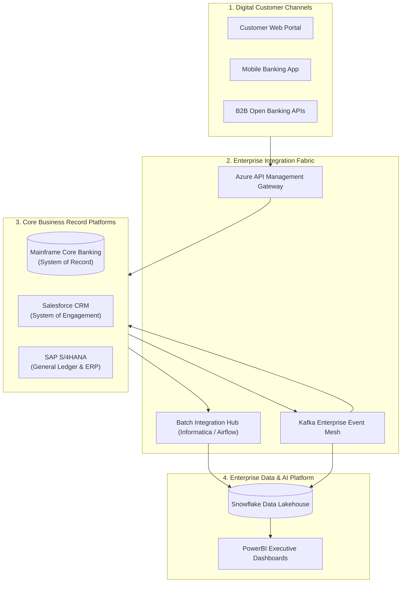
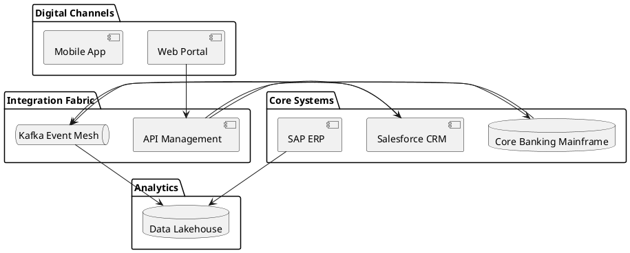

# Macro Enterprise Integration Landscape

High-level enterprise system landscape mapping macro integration channels across core operational platforms, digital customer channels, and cloud data lakes.

## Mermaid Architecture Diagram

## PlantUML Specification

## Architectural Design Considerations

* **Holistic View**: Provides executive stakeholders and ARB with a single comprehensive picture of enterprise data flows and system couplings.
* **System of Record vs Engagement**: Clearly separate systems of record (mainframes, ERPs) from agile systems of engagement (mobile apps, customer portals).
* **Modernization Roadmap**: Use this landscape to highlight legacy point-to-point connections targeted for decommissioning.

## Related Documentation & Patterns

* [Business Capability Map](file:///d:/company/products/enterprise-architecture-handbook/17-diagrams/enterprise/business-capability-map.md)
* [Application Portfolio](file:///d:/company/products/enterprise-architecture-handbook/17-diagrams/enterprise/application-portfolio.md)
* [Integration: Point-to-Point](file:///d:/company/products/enterprise-architecture-handbook/17-diagrams/integration/point-to-point.md)
