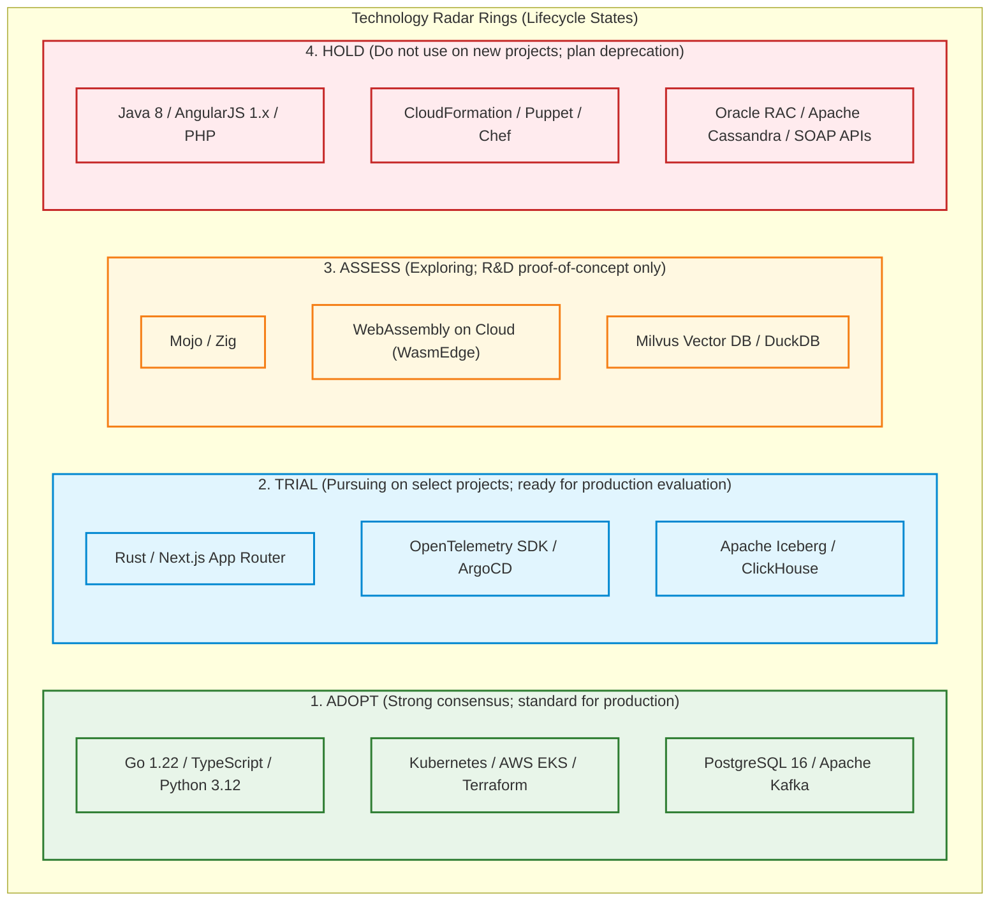
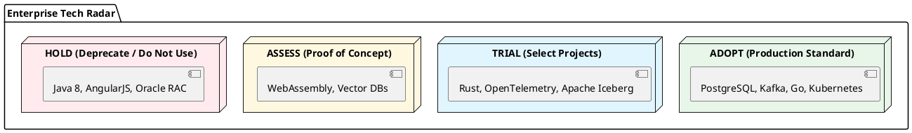

# Enterprise Technology Radar (Adopt, Trial, Assess, Hold)

ThoughtWorks style enterprise technology radar governing technology lifecycle adoption across Languages & Frameworks, Platforms, Tools, and Data Stores.

## Mermaid Architecture Diagram

## PlantUML Specification

## Architectural Design Considerations

* **Prevent Technology Proliferation**: Constrains organizational cognitive load by establishing an agreed, vetted baseline of supported technologies.
* **Controlled Innovation**: Provides an established path for engineers to experiment with new technologies (Assess $
ightarrow$ Trial $
ightarrow$ Adopt).
* **Sunset Governance**: The 'Hold' ring clearly communicates to development teams that older technologies must not be chosen for greenfield initiatives.

## Related Documentation & Patterns

* [Business Capability Map](file:///d:/company/products/enterprise-architecture-handbook/17-diagrams/enterprise/business-capability-map.md)
* [Application Portfolio](file:///d:/company/products/enterprise-architecture-handbook/17-diagrams/enterprise/application-portfolio.md)
* [Architecture: Trade-off Matrix](file:///d:/company/products/enterprise-architecture-handbook/17-diagrams/architecture/tradeoff-matrix.md)
