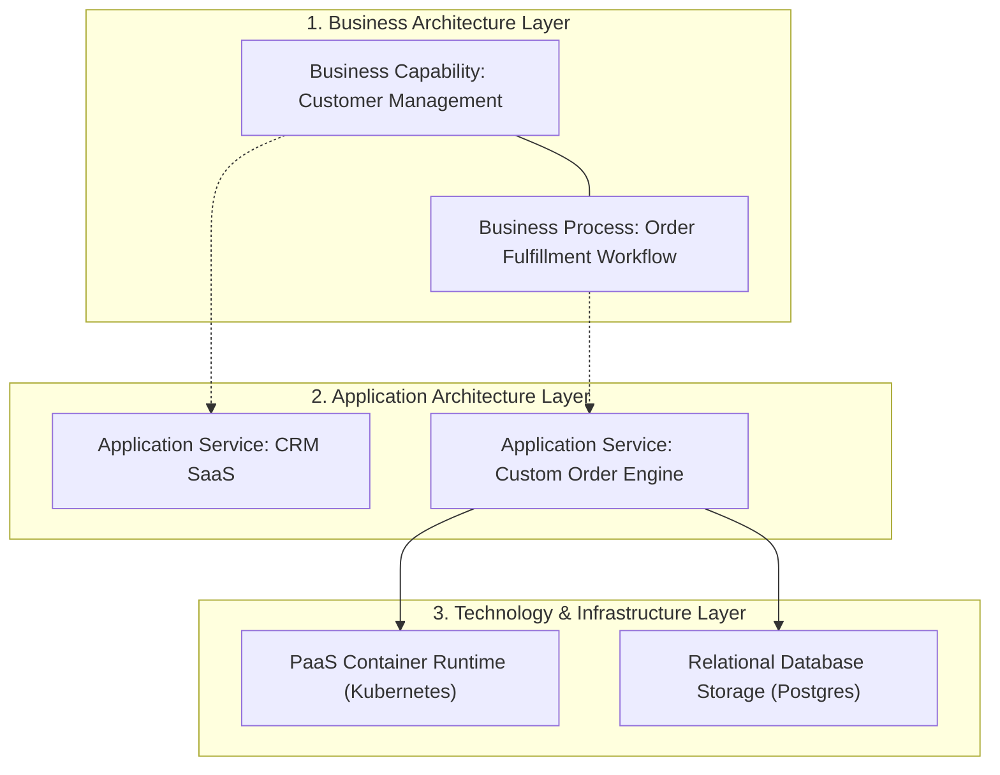
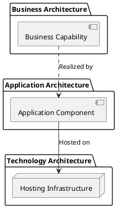

# Enterprise Architecture Diagram Starter Template

Production-ready boilerplate template for authoring enterprise-level capability mappings, application portfolios, and cross-enterprise system landscapes.

## Mermaid Architecture Diagram

## PlantUML Specification

## Architectural Design Considerations

* **TOGAF Alignment**: Standardizes the tripartite alignment between Business Architecture, Application Architecture, and Technology Architecture.
* **Traceable Value**: Shows how technical infrastructure investments directly support core business capabilities.
* **Consistent Layout**: Business layer on top, application layer in the middle, technology layer at the bottom.

## Related Documentation & Patterns

* [Business Capability Map](file:///d:/company/products/enterprise-architecture-handbook/17-diagrams/enterprise/business-capability-map.md)
* [Application Portfolio](file:///d:/company/products/enterprise-architecture-handbook/17-diagrams/enterprise/application-portfolio.md)
* [Enterprise Review Checklist](file:///d:/company/products/enterprise-architecture-handbook/17-diagrams/enterprise/checklists.md)
