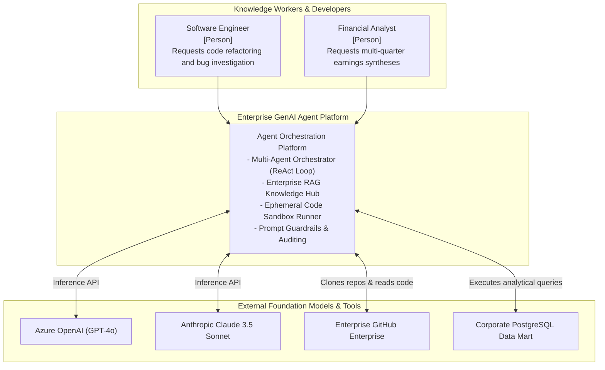
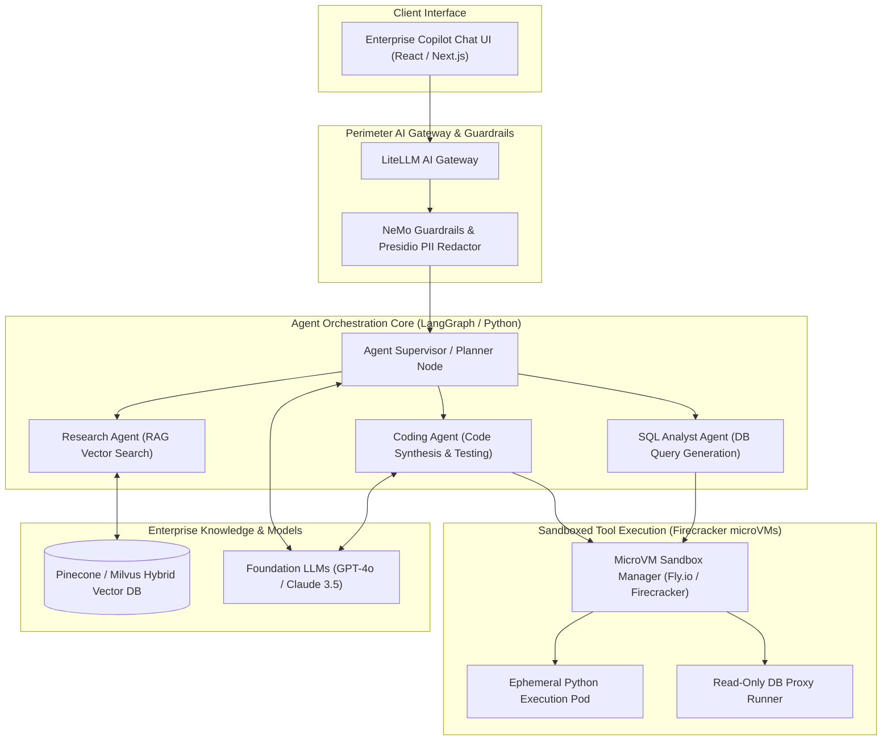
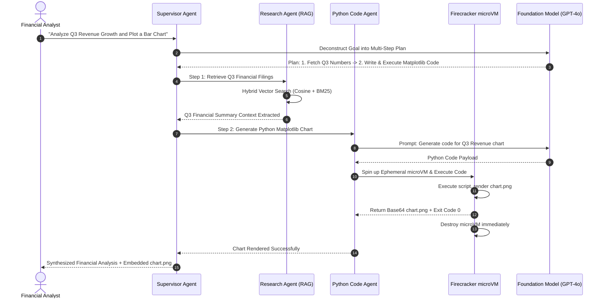

# Enterprise Generative AI Agent Platform Architecture

This reference architecture models a secure enterprise Generative AI agent platform orchestrating multi-agent collaboration, semantic RAG retrieval, sandboxed external tool execution, and real-time prompt guardrails.

## 1. Business Context & Architectural Drivers
* **Autonomous Task Execution**: Enable autonomous agents to deconstruct high-level business goals, select appropriate APIs, and execute multi-step workflows.
* **Enterprise Security & DLP**: Prevent Prompt Injection (OWASP LLM01) and redact sensitive PII/secrets before sending context to external foundation models.
* **Deterministic Sandboxing**: Isolate all LLM-generated code execution inside ephemeral, network-restricted microVMs with strict memory and CPU caps.

## 2. C4 Level 1: System Context

## 3. C4 Level 2: Multi-Agent Orchestration & Sandboxed Tool Execution

## 4. Multi-Agent Collaborative Task Execution Sequence

## 5. Architectural Decisions
* **MicroVM Sandboxing**: All user- or LLM-generated code runs in ephemeral Firecracker microVMs that boot in 5ms and are destroyed immediately after execution.
* **Hybrid Search with Document ACLs**: Vector retrieval includes enterprise user authorization metadata, preventing analysts from accessing restricted executive filings.
