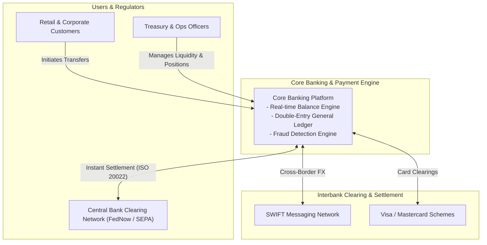
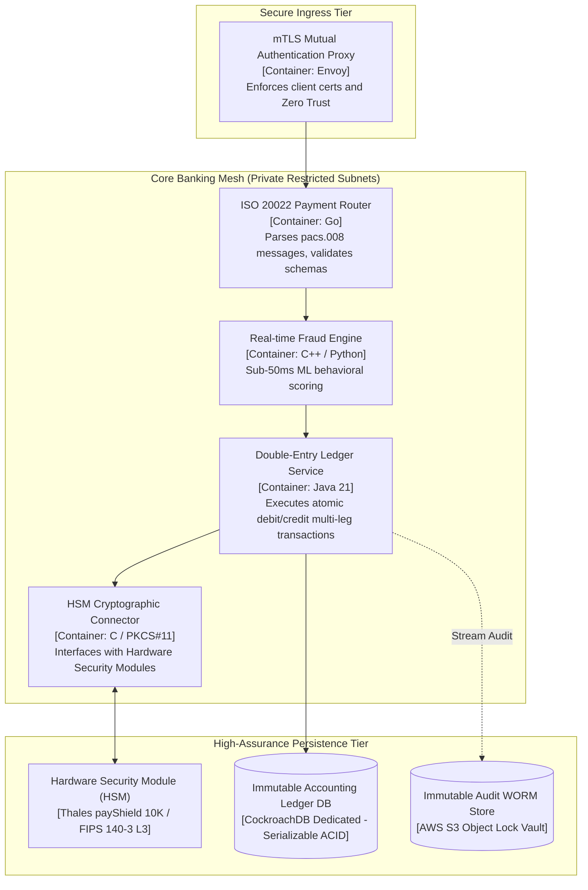
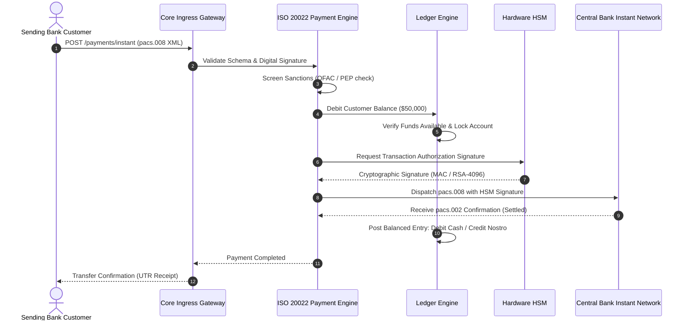

# Core Banking & Real-Time Payments Architecture

This reference architecture models a next-generation core banking platform supporting real-time gross settlement (RTGS), ISO 20022 message compliance, double-entry immutable ledgers, and Hardware Security Module (HSM) transaction signing.

## 1. Business Context & Architectural Drivers
* **Throughput Target**: 5,000 settlements/second; zero tolerance for data loss (RPO = 0, RTO $\le 30$ seconds).
* **Compliance**: Strict adherence to ISO 20022 (pacs.008, pacs.002), PCI-DSS Level 1, and Central Bank regulatory frameworks.
* **Security**: FIPS 140-3 Level 3 HSM hardware cryptography for transaction signing and key generation.

## 2. C4 Level 1: System Context

## 3. C4 Level 2: Container Architecture & HSM Integration

## 4. Real-Time Payment Settlement Sequence (ISO 20022)

## 5. Architectural Principles & Controls
* **Double-Entry Accounting Invariant**: Every debit must have an equal and offsetting credit; `SUM(Debits) - SUM(Credits) == 0` enforced at the database schema level via constraint triggers.
* **Immutable Journaling**: Ledger tables are strictly append-only; historical corrections are performed exclusively through explicit reversing entries.
* **Network Micro-segmentation**: Hardware HSMs and ledger database clusters are isolated in dedicated Tier-4 private security zones with zero external routing.
