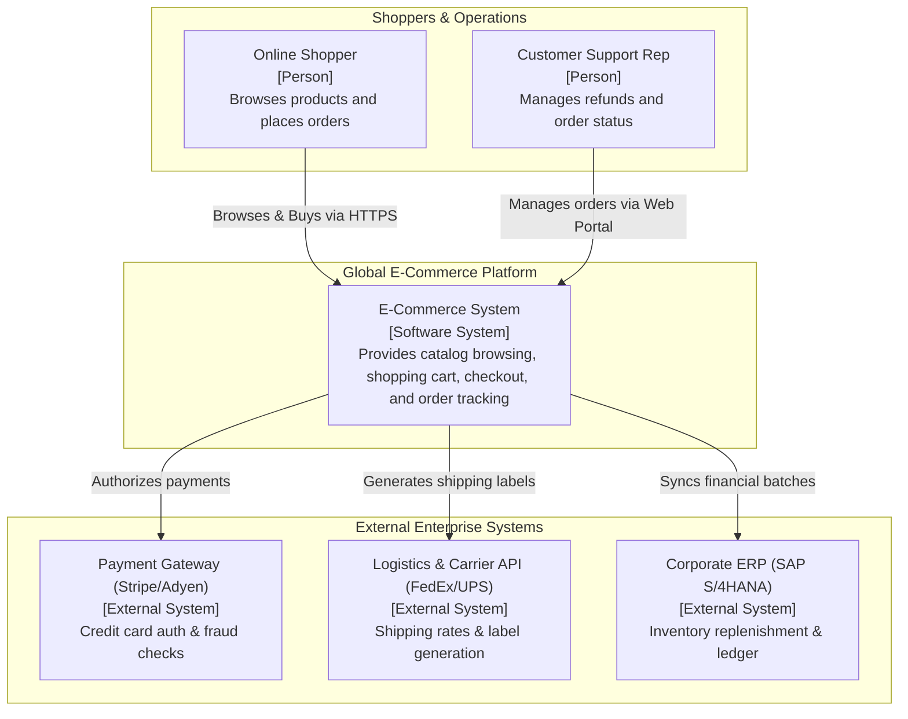
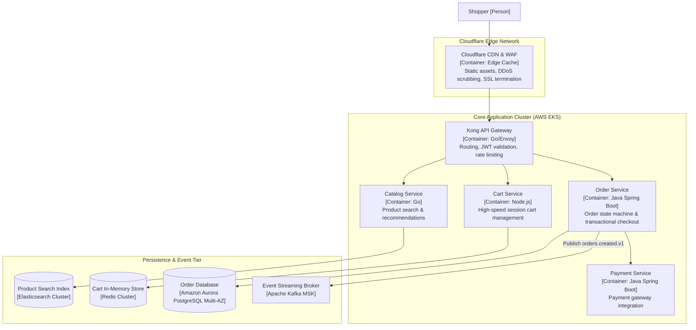
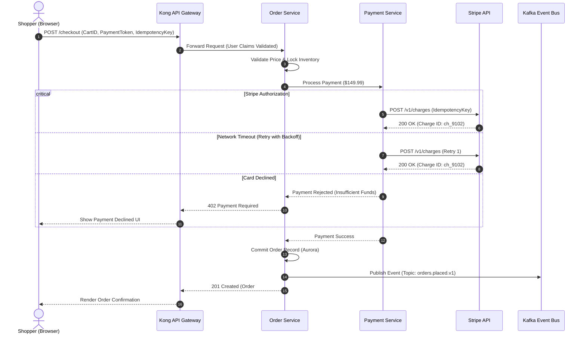
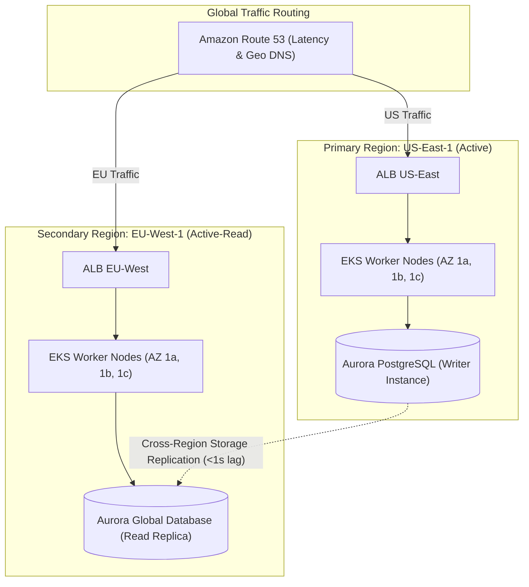

# Global E-Commerce Platform Reference Architecture

This reference architecture models a global, multi-region digital commerce platform engineered for high-concurrency flash sales, sub-second checkout, and resilient event-driven order fulfillment.

## 1. Business Context & Architectural Drivers
* **Throughput Target**: Sustained 15,000 requests/sec with peak flash-sale bursts up to 80,000 requests/sec.
* **Latency SLA**: p99 checkout response time $\le 350$ms globally.
* **Availability**: 99.99% availability (less than 52 minutes of downtime per year).
* **Consistency Model**: Eventual consistency for search catalogs and inventory reservations; strong serializable consistency for payment authorization and ledger balance.

## 2. C4 Level 1: System Context

## 3. C4 Level 2: Container Architecture

## 4. Checkout Sequence Flow with Fallback

## 5. Physical Deployment & Multi-Region Topology

## 6. Key Architecture Decision Records (ADRs)
* **ADR-01: Microservices vs Modular Monolith**: Decomposed into 6 bounded microservices due to distinct scaling profiles (Catalog: 95% reads; Checkout: 100% ACID writes).
* **ADR-02: Inventory Reservation Strategy**: Implemented Redis distributed locks with 10-minute TTL for flash-sale cart reservations to protect relational databases.
* **ADR-03: Eventual Consistency for Fulfillment**: Order placement succeeds immediately upon payment authorization; warehouse allocation is handled asynchronously via Kafka consumers.
