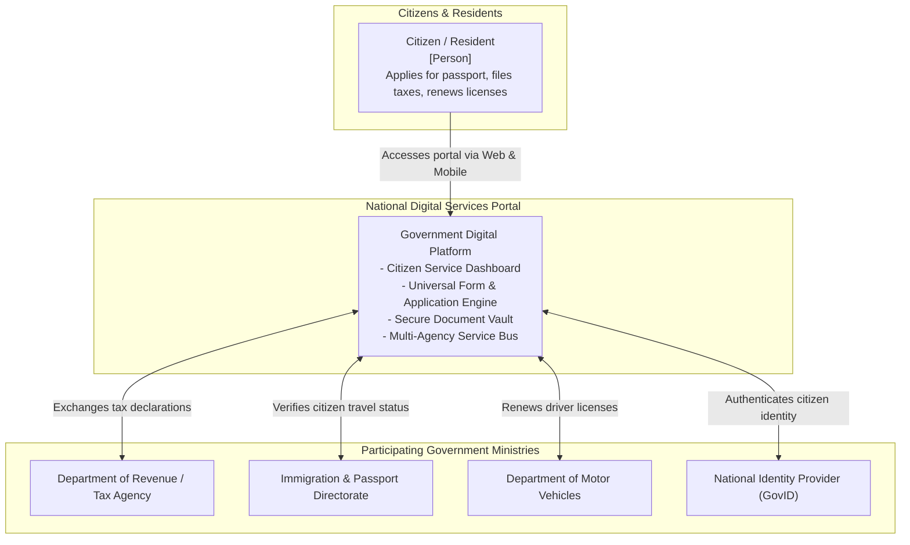
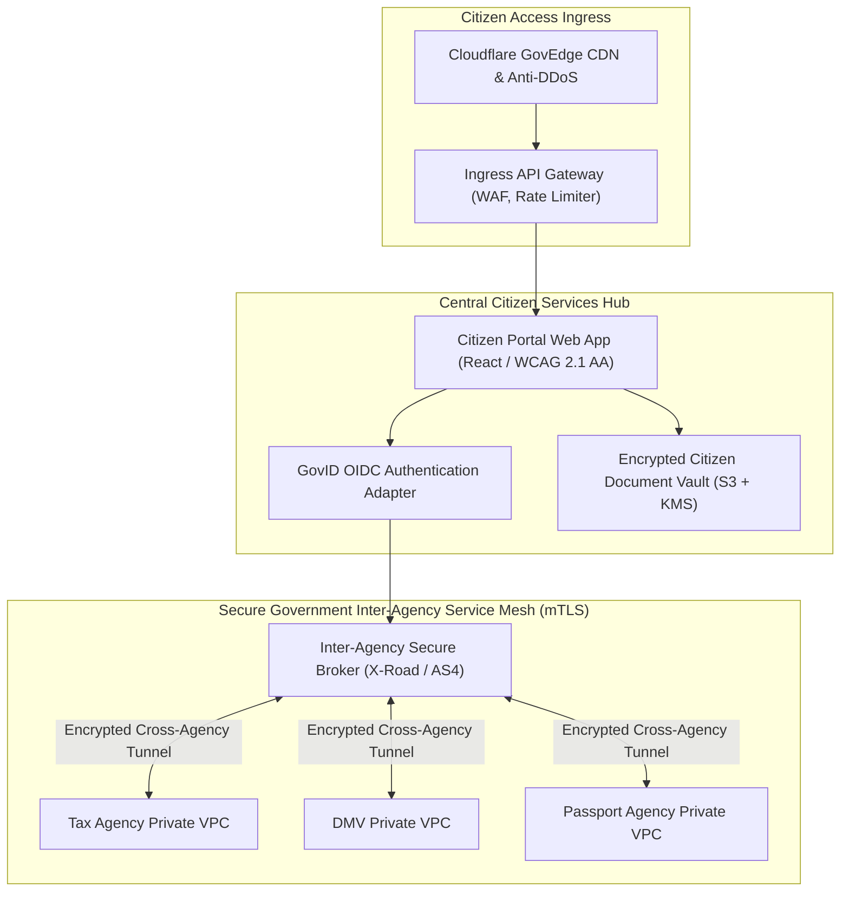
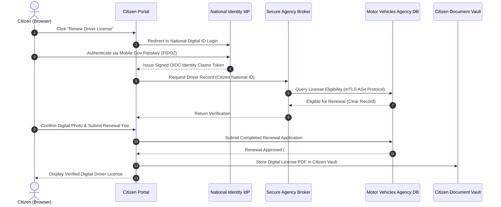

# Government Digital Services Portal Architecture

This reference architecture models a secure, accessible national citizen digital services platform supporting federated National Digital ID authentication, high-concurrency tax filings, and inter-agency zero-trust data exchanges.

## 1. Business Context & Architectural Drivers
* **Massive Concurrency Peak**: Support 250,000 concurrent citizen sessions during national tax filing and census deadlines without degradation.
* **National Digital Identity**: OpenID Connect (OIDC) integration with government smartcards, biometrics, and mobile identity apps.
* **Data Sovereignty & Security**: Zero-trust multi-agency data isolation; citizen data cannot be merged across agencies without explicit legislative consent.

## 2. C4 Level 1: System Context

## 3. C4 Level 2: Zero-Trust Inter-Agency Data Exchange

## 4. Citizen Service Application Sequence Flow

## 5. Accessibility & Security Compliance
* **Universal Accessibility**: 100% compliance with WCAG 2.1 Level AA and Section 508 accessibility standards across all screen readers and mobile viewports.
* **X-Road Data Exchange Protocol**: Distributed data exchange architecture preventing central data consolidation; agencies remain independent autonomous data custodians.
