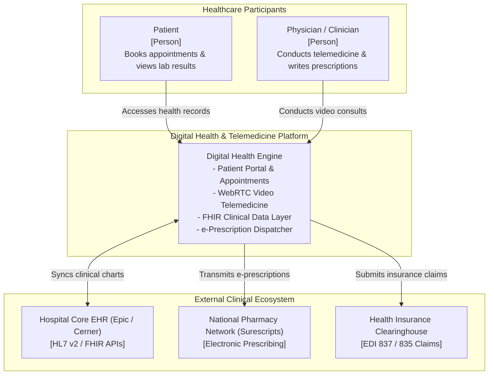
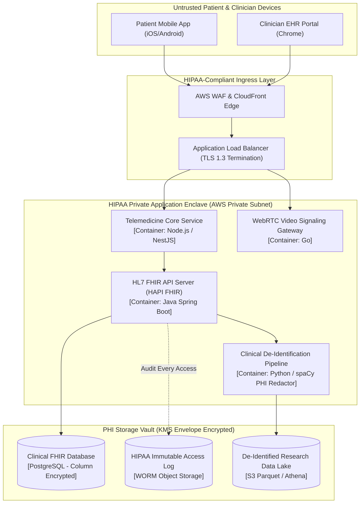

# Healthcare Electronic Health Records (EHR) & Telemedicine Architecture

This reference architecture models a secure, HIPAA/HITECH-compliant healthcare digital ecosystem connecting Electronic Health Records (EHR), FHIR APIs, video telemedicine consults, and automated clinical data de-identification.

## 1. Business Context & Architectural Drivers
* **Regulatory Mandates**: HIPAA Security and Privacy Rule compliance, HITECH Act, and HL7 FHIR Release 4 interoperability mandates.
* **Latency SLA**: Real-time WebRTC audio/video latency $\le 150$ms for remote clinical examinations.
* **Data Scoping**: Absolute separation between Protected Health Information (PHI) and clinical analytics.

## 2. C4 Level 1: System Context



## 3. C4 Level 2: Container Architecture & HIPAA Segregation



## 4. Telemedicine Consultation Sequence Flow

```mermaid
sequenceDiagram
    autonumber
    actor Patient as Patient
    actor Doctor as Doctor
    participant Signal as WebRTC Signaling Server
    participant Turn as LiveKit / Twilio Media Server
    participant EHR as FHIR Clinical Server
    participant Audit as HIPAA Audit Store

    Patient->>Signal: Join Video Room (Encrypted Room Token)
    Doctor->>Signal: Join Video Room (Physician Credentials)
    Signal-->>Patient: Exchange SDP Offer & ICE Candidates
    Signal-->>Doctor: Exchange SDP Answer & ICE Candidates
    
    Patient<-->>Turn: Establish Direct Encrypted Media Stream (SRTP/DTLS)
    Doctor<-->>Turn: Establish Direct Encrypted Media Stream (SRTP/DTLS)
    
    Note over Patient,Doctor: Telemedicine Examination Conducted
    
    Doctor->>EHR: POST /fhir/Observation (Vital Signs, Diagnosis)
    Doctor->>EHR: POST /fhir/MedicationRequest (Prescription)
    EHR->>Audit: Record PHI Access (Doctor ID, Patient ID, Timestamp, Action)
    EHR-->>Doctor: 201 Created (Clinical Note Saved)
```

## 5. Security & Privacy Controls
* **Zero Trust PHI Access**: Every database read/write query records the authenticated clinician's National Provider Identifier (NPI) to satisfy HIPAA $\S 164.312$ audit controls.
* **Safe Harbor De-Identification**: Automated pipelines remove all 18 HIPAA identifiers (names, dates, zip codes, record numbers) before replicating data to research lakes.
