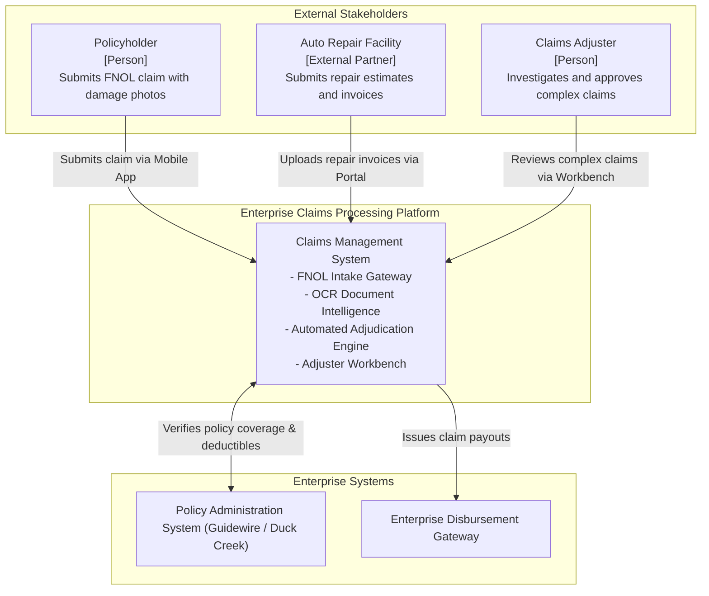
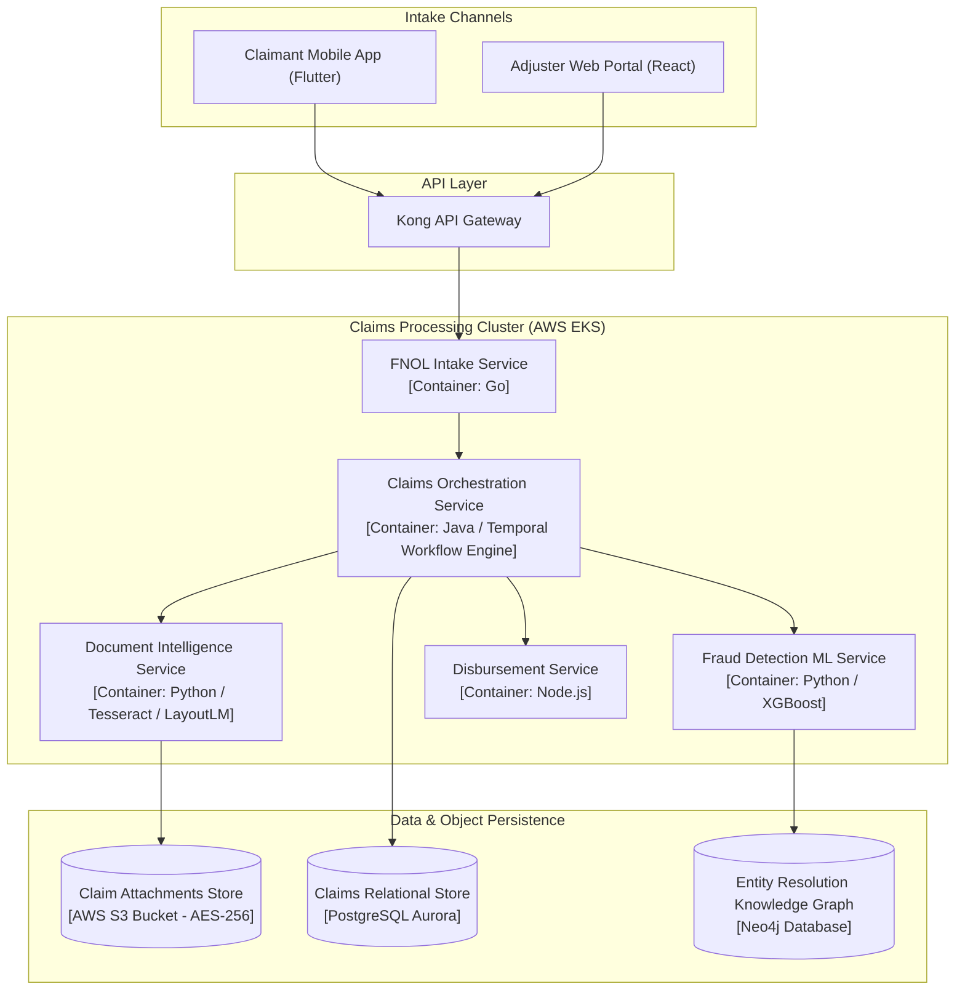
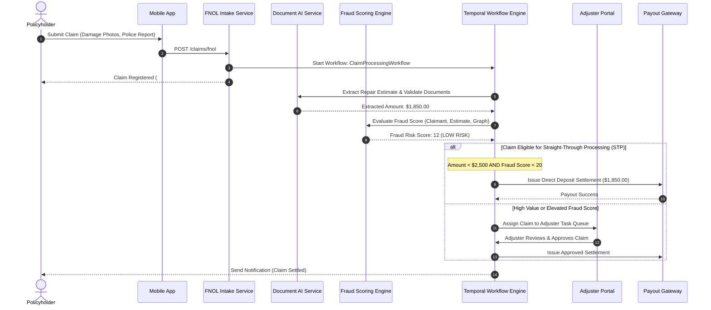

# Enterprise Insurance Claims Processing Architecture

This reference architecture models an automated property and casualty (P&C) insurance claims processing engine featuring multi-channel First Notice of Loss (FNOL), OCR document intelligence, real-time fraud scoring, and human-in-the-loop adjuster workflows.

## 1. Business Context & Architectural Drivers
* **Processing Speed**: Straight-Through Processing (STP) target of 60% of low-complexity auto and property claims under $2,500 without human intervention.
* **Fraud Detection**: Reduce claims fraud leakage by executing real-time anomaly detection across policy history, social networks, and damage telemetry.
* **Document Ingestion**: Multi-modal intake supporting scanned PDFs, smartphone photos, police reports, and dashcam videos.

## 2. C4 Level 1: System Context

## 3. C4 Level 2: Container Architecture & Workflow Engine

## 4. End-to-End FNOL to Settlement Sequence

## 5. Architectural Decisions
* **Temporal Workflow Orchestration**: Claims lifecycles span hours to weeks; Temporal provides durable execution, automated timers, and guaranteed state recovery across system restarts.
* **Graph Database for Fraud Detection**: Neo4j maps relationships between claimants, body shops, attorneys, and doctors to uncover organized claims fraud rings.
