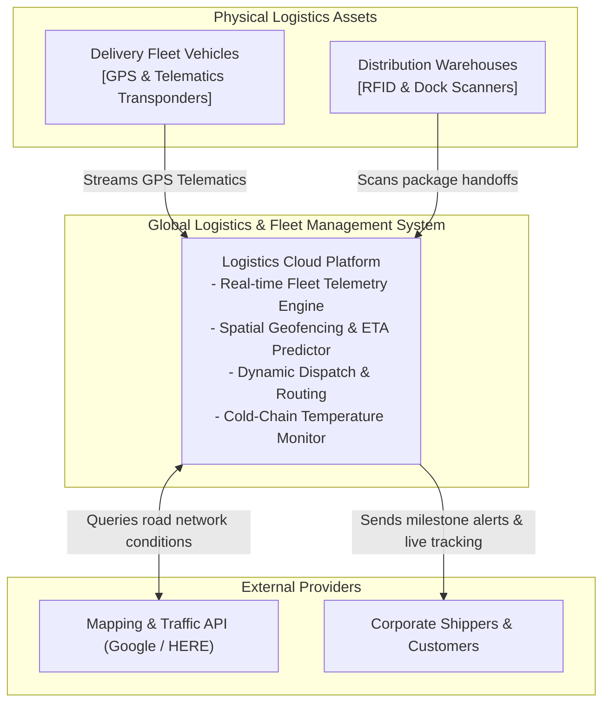
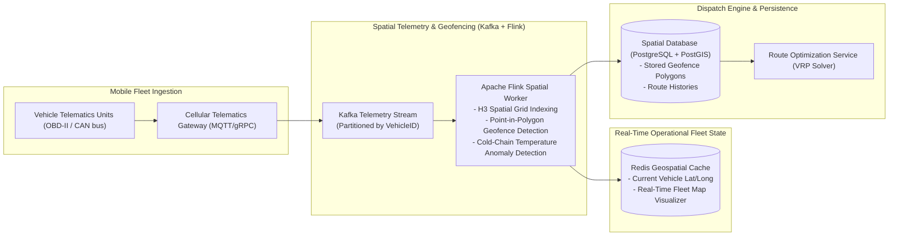
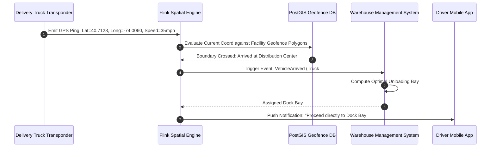

# Supply Chain & Fleet Logistics Architecture

This reference architecture models a real-time global freight logistics platform featuring GPS vehicle telematics, dynamic geofencing, route optimization algorithms, and automated cross-dock warehouse dispatching.

## 1. Business Context & Architectural Drivers
* **Fleet Telemetry Scale**: Track 100,000 active delivery vehicles streaming GPS coordinates and temperature sensors every 10 seconds.
* **Geofence Processing Latency**: Evaluate automated arrival and departure geofencing triggers in $\le 500$ms.
* **Route Optimization**: Real-time vehicle dynamic rerouting based on live traffic congestion and warehouse dock availability.

## 2. C4 Level 1: System Context

## 3. C4 Level 2: Spatial Telematics & Ingestion Topology

## 4. Geofence Arrival & Automated Dock Assignment Sequence

## 5. Architectural Decisions
* **Uber H3 Spatial Hexagonal Indexing**: Discrete global grid coordinates reduce expensive polygon ray-casting calculations into fast integer hash table lookups.
* **Cold-Chain Safety Sinks**: Continuous temperature violations immediately trigger quarantine events in the logistics warehouse management system before unloading.
