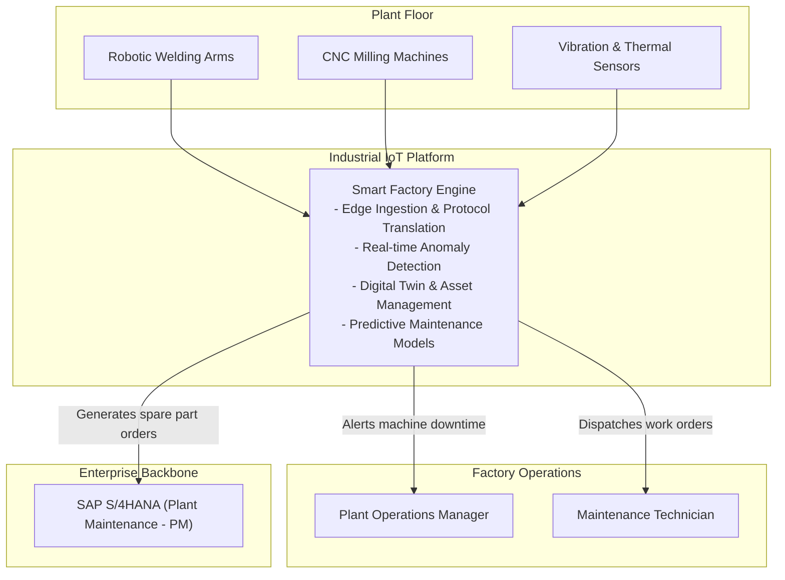
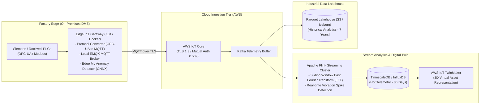
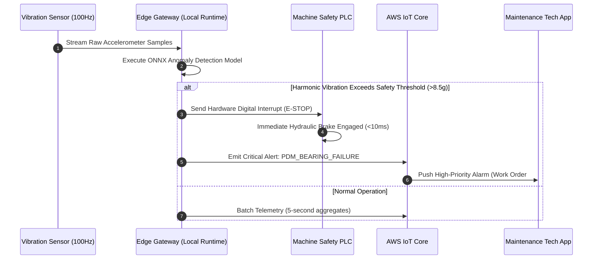

# Smart Manufacturing & Industrial IoT (IIoT) Architecture

This reference architecture models an industrial IoT smart factory ecosystem connecting manufacturing floor PLCs, edge MQTT brokers, time-series telemetry pipelines, digital twin simulations, and predictive maintenance ML models.

## 1. Business Context & Architectural Drivers
* **Real-Time Edge Analytics**: Detect machine anomaly vibrations and thermal spikes at the factory edge within 10ms to trigger emergency stops.
* **Protocol Bridging**: Ingest legacy factory protocols (Modbus, OPC-UA, Profinet) and translate them to lightweight MQTT/Protobuf.
* **Scale**: Support 50,000 industrial sensors per plant streaming telemetry at 100Hz into a central cloud time-series lakehouse.

## 2. C4 Level 1: System Context

## 3. C4 Level 2: Edge-to-Cloud Streaming Pipeline

## 4. Edge Anomaly Detection & Emergency Stop Sequence

## 5. Architectural Decisions
* **Local Autonomy at Edge**: Anomaly detection and safety interlocks run locally on ruggedized edge servers with zero dependence on cloud WAN connectivity.
* **Time-Series Columnar Lakehouse**: Telemetry is written directly to Apache Iceberg formatted Parquet files, reducing storage costs by 80% compared to traditional relational stores.
