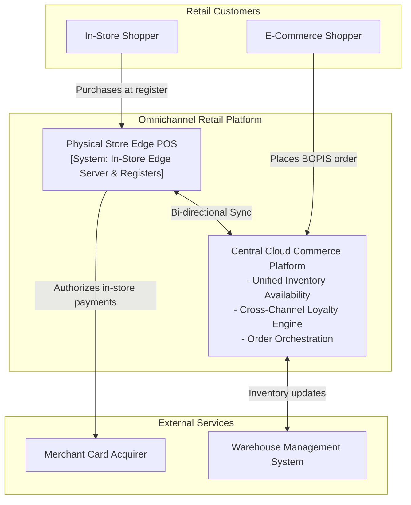
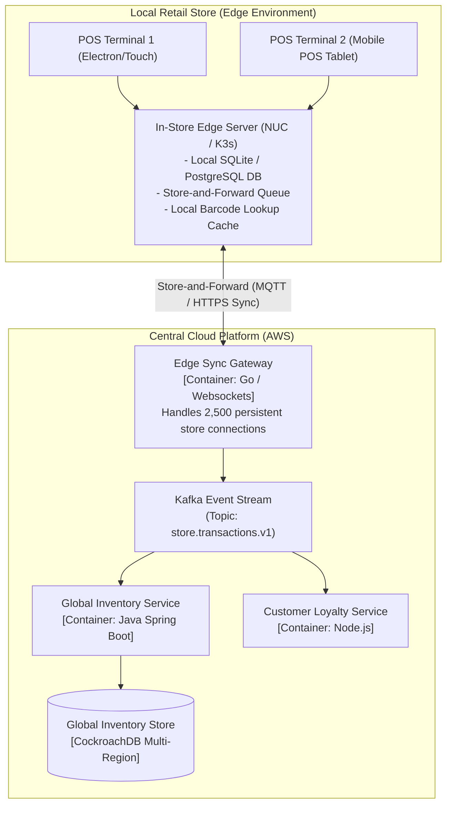
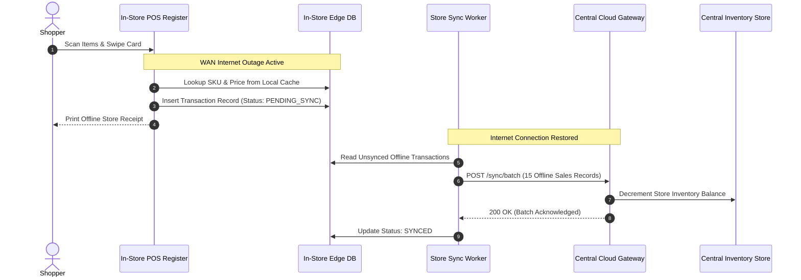

# Retail Omnichannel & Edge POS Architecture

This reference architecture models a resilient, omnichannel retail platform uniting physical Point-of-Sale (POS) terminals, e-commerce web storefronts, real-time inventory availability, and unified loyalty programs across thousands of retail stores.

## 1. Business Context & Architectural Drivers
* **Offline-First Store Resilience**: Physical retail stores must process sales, scan barcodes, print receipts, and accept offline credit card swipes during internet WAN outages.
* **Unified Inventory Visibility**: Real-time Buy Online, Pick Up in Store (BOPIS) visibility across 2,500 retail stores and 10 regional distribution centers.
* **Sub-Second Synchronization**: Store sales sync to the central cloud platform within 2 seconds of internet reconnection.

## 2. C4 Level 1: System Context

## 3. C4 Level 2: Edge-to-Cloud Synchronization Topology

## 4. Offline POS Transaction & Eventual Sync Sequence

## 5. Architectural Decisions
* **Store-and-Forward Pattern**: Sales transactions are written to local disk before network transmission; POS operations are completely immune to cloud network disruptions.
* **Optimistic Offline Card Auth**: Stores accept offline credit transactions up to $100 per swipe during outages, balancing fraud risk against lost sales volume.
