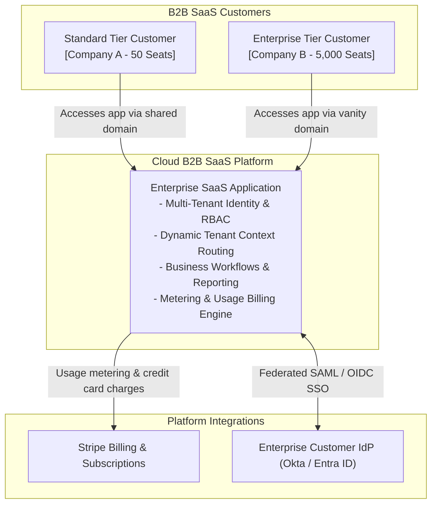
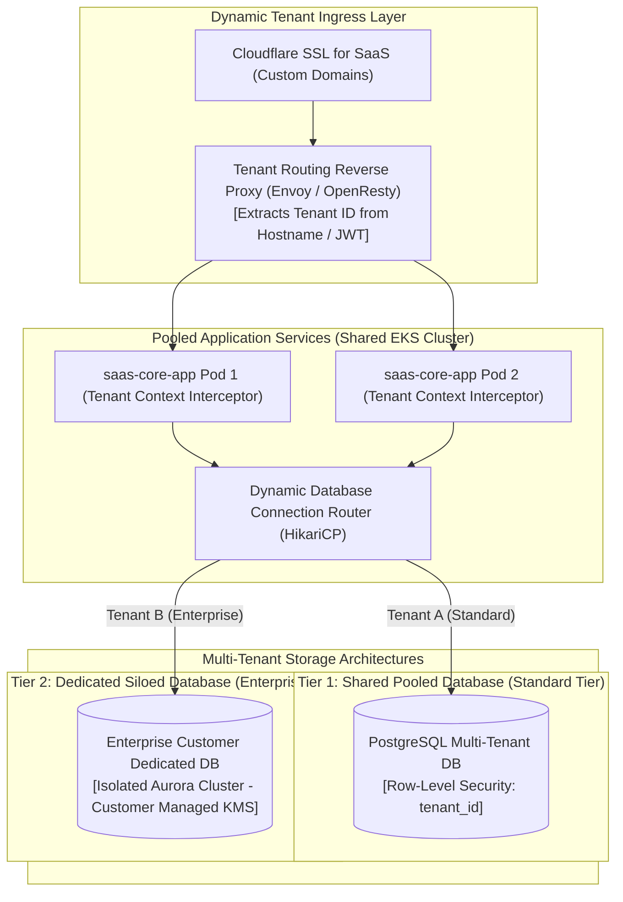
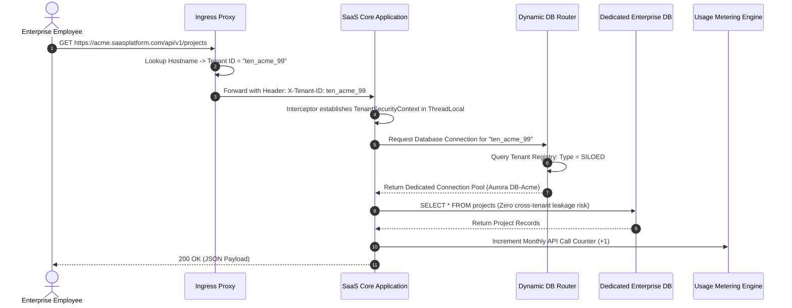

# Enterprise Multi-Tenant B2B SaaS Architecture

This reference architecture models a modern, highly scalable multi-tenant B2B SaaS application supporting hybrid tenant isolation models (Pooled vs Siloed), dynamic database routing, custom tenant domain branding, and tenant quota metering.

## 1. Business Context & Architectural Drivers
* **Isolation Models**: Support Free/Standard tiers on cost-efficient shared pooled infrastructure while offering Enterprise tiers dedicated isolated databases (Silo).
* **Tenant Noisy-Neighbor Mitigation**: Hard rate-limiting and compute throttling per tenant to ensure no single tenant degrades global platform performance.
* **Custom Domains**: Dynamic SSL certificate provisioning and routing for enterprise customer vanity domains (e.g., `app.customer.com`).

## 2. C4 Level 1: System Context

## 3. C4 Level 2: Hybrid Tenant Isolation Topology (Pool vs Silo)

## 4. Tenant Request Lifecycle & Dynamic Routing Sequence

## 5. Architectural Decisions
* **PostgreSQL Row-Level Security (RLS)**: In pooled tiers, RLS policies enforce `WHERE tenant_id = current_setting('app.current_tenant_id')` on every table to prevent coding errors from leaking data.
* **Tenant-Aware Rate Limiting**: Redis Token Bucket rate limiters keyed by `tenant_id` guarantee that an aggressive script from Tenant A cannot exhaust API Gateway capacity for Tenant B.
