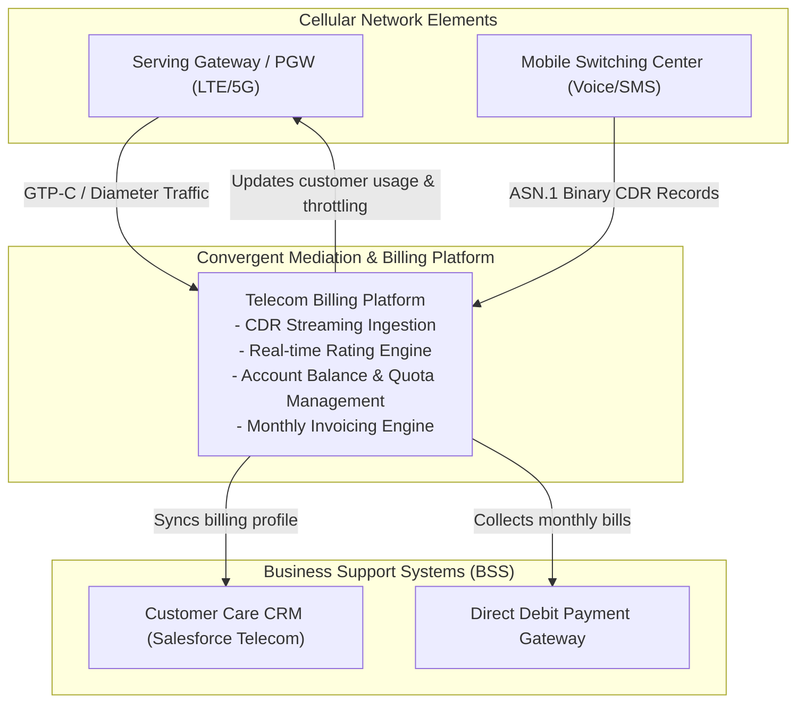
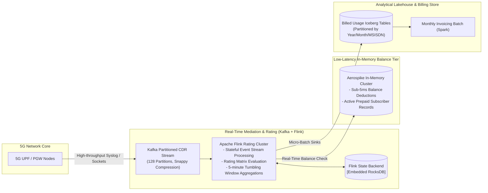
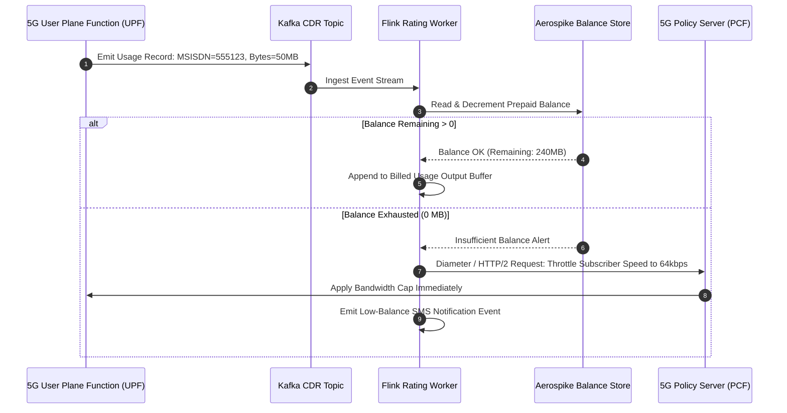

# Telecom Call Detail Record (CDR) & Real-Time Billing Architecture

This reference architecture models a telecom mediation and convergent billing engine processing 500,000 call detail records (CDRs) and data usage packets per second with real-time rating, quota enforcement, and automated invoicing.

## 1. Business Context & Architectural Drivers
* **Throughput Capacity**: Sustained ingest of 500,000 CDRs/sec with burst tolerance up to 1,200,000 events/sec.
* **Rating Latency**: Real-time prepaid balance decrement and quota enforcement under 50ms.
* **Durability Guarantee**: Exactly-once processing; zero lost billable usage records.

## 2. C4 Level 1: System Context

## 3. C4 Level 2: Stream Processing & Ingestion Pipeline

## 4. Real-Time Data Usage Rating Sequence

## 5. Architectural Decisions
* **Aerospike for Subscriber Balance**: Sub-millisecond reads/writes at scale without JVM garbage collection pauses.
* **Apache Iceberg for Long-Term CDR History**: Enables Petabyte-scale CDR archival with time-travel queries for regulatory customer dispute audits.
